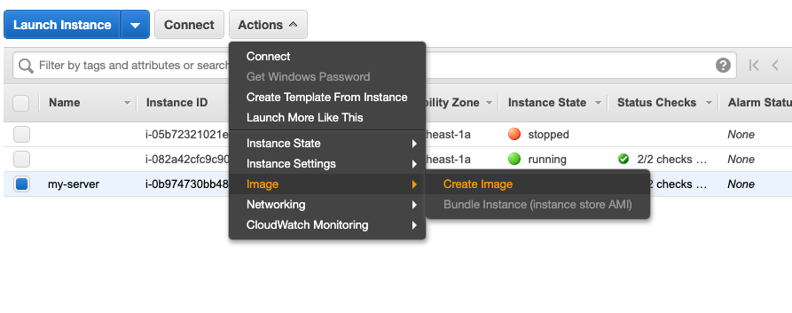
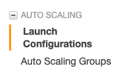
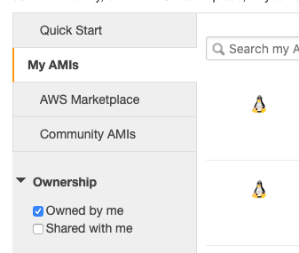
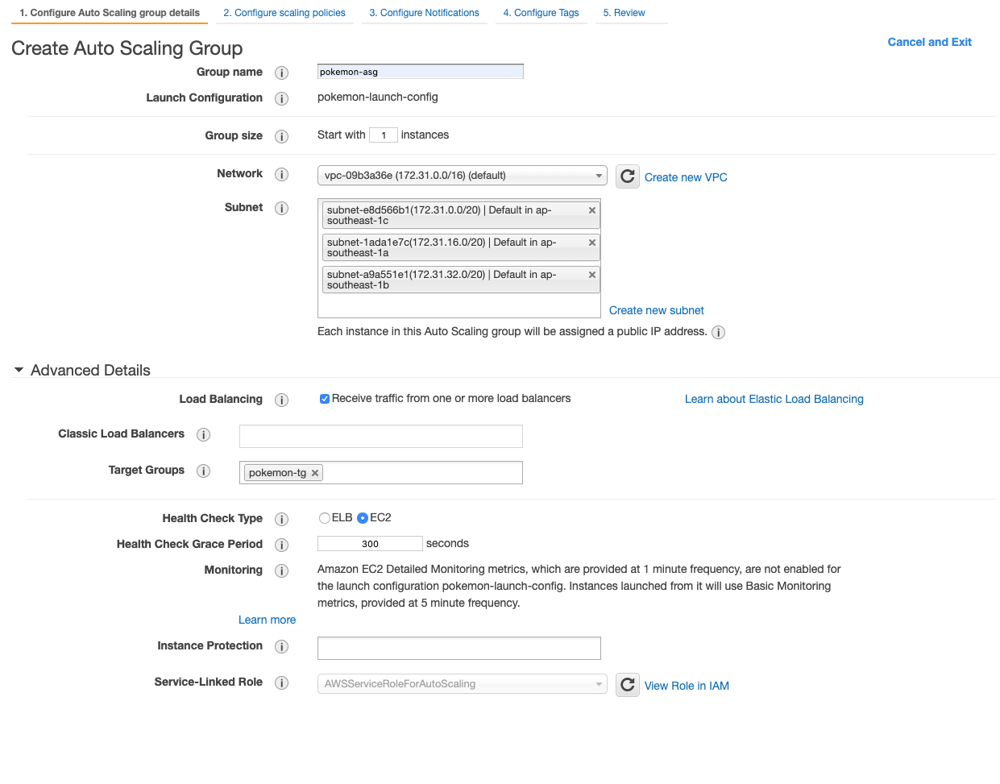
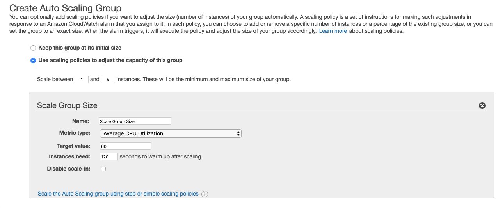
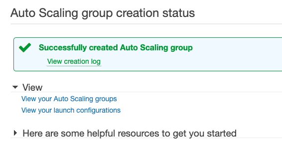

# Auto Scaling Group

An Auto Scaling group contains a collection of Amazon EC2 instances that are treated as a logical grouping for the purposes of automatic scaling and management. An Auto Scaling group also enables you to use Amazon EC2 Auto Scaling features such as health check replacements and scaling policies. Both maintaining the number of instances in an Auto Scaling group and automatic scaling are the core functionality of the Amazon EC2 Auto Scaling service. - [ASG docs](https://docs.aws.amazon.com/autoscaling/ec2/userguide/AutoScalingGroup.html)

Many reasons an application can get a sudden spike in usage, such  Covid outbreaks, winter sales, fighting for exam slots, concert booking on ticketing website, checking of PSI level, following the latest breaking news. You probably will want your site to handle a spike in traffic.

Traditional with your local server, you will have a limit on how many servers you can run by the computing power you have. On cloud computing, you can easily upscale your computing power and remove them when you no longer need. This is what Auto Scaling is trying to do.

## Creating an Amazon Machine Images(AMI)

An Amazon Machine Image (AMI) provides the information required to launch an instance. - [AMI docs](https://docs.aws.amazon.com/AWSEC2/latest/UserGuide/AMIs.html)

Select the EC2 instance that is running and create a snapshot by selecting the instance and click on the `Actions` button > `image` > `Create image`

This will create a new image under the `AMIs` tab on the left.

## Creating Launch Configuration

Next create a launch configuration, on the navigation panel on the left, Look under `Auto Scaling` and click on `Launch Configuration`

This will prompt you to select a base image. Look for the image you have created.

Select the same instance type as what you previously used to create the EC2 instance you want to scale.

Give your launch configuration a name

Select the same security group as the EC2 instance you have created

If you want to SSH to your instance, you can select key-value pair, if not just choose not to have one.

Next, create an ASG, add in all subnets here to allow creating of instances across different subnets for higher availability.

Click on advance and check on `Receive traffic from one or more load balancers`

Select the target group you created for the load balancer.

Next select `Use scaling policies to adjust the capacity of this group`

Here there is a few important concept

`Scale between <min> and <max> instances. These will be the minimum and maximum size of your group`

Minimum instance refer to to the minimum amount of instance ASG will create for you. Max refer the maximum amount of instance ASG will create for you.

ASG will need some metric to determine when to create a new instance for you. There are few default metric. The most popular being `Average CPU Utilization`. Which determine CPU usage across multiple instance before determining to create new instance or remove existing instance. When an instance is created, it will require some startup time, especially if you have startup scripts. You can `Disable scale-in` to prevent ASG to remove instances for you.

### Terminology summary

- minimum instances: the minimum amount of instance that is running
- maximum instances: the max amount of instances that can run no matter how the metric is
- scale out: Create new instances
- scale in: Remove existing instances
- metric Type: determine what cause a scale in or out
- target value: what is the threshold to scale in or out based on the metric type
- instance need: the time required for an instance to startup.
- Disable scale-in: Don't remove instances even when usage drop.

You can also have different metric for scaling in and out.

Review

## Lab

1. Setup a Launch Configurations
2. Setup an Auto Scaling group
3. Observe the instance created
4. Stop the instance, refresh after a few mins and observe the instance get recreated for you.
