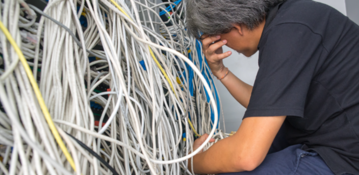

# Cloud Computing

the practice of using a network of remote servers hosted on the Internet to store, manage, and process data, rather than a local server or a personal computer. - Dictionary.com

## Pre Cloud Computing days

- Many companies need to maintain their server to host their own application. This is higly costly for the company in both infrastucture and hiring a good maintainer for the server. Unless you need a massive amount of server, is likely to be cheaper to use a
-

### Disadvantage

- Highly costly, rental space, cooling for manpower, server racks, servers, updating hardware when necessary
- High manpower, need people with specialise knowledge.
- Long setup time, if you need a host an applicaiton, you need to purchase servers, find a room, setup cooling, set up racks
- Lower performance, your server are hosted in a single location, request from another country will have their network request travel across the world.
- High wastage, your server might need to handle the maximum load possible, say supermarket will spike during before a pandemic situation lockdown. You will need lots of powerful servers to handle the load and they will be mostly idle duing non peak peroid.
- High maintainance, your server need to be up to date with the latest security update.

## Benfits of using Cloud Computing

[benefits](https://www.salesforce.com/products/platform/best-practices/benefits-of-cloud-computing/#)

## Properties of Cloud Computing

## Elasticity

- resource should be availble on demand
- no long waiting, setup, getting licence

## Simplicity

- With minimum configuration, administrator can setup a new server

## Scalability

- If there is a change in demand on users, additional resouce can be easily added or remove

## Types of cloud computing

### Software As A Service (SAAS)

You create a account and user the service like a email, facebook etc.

### Platform As A Service (PAAS)

You are promise a place in some server you don’t have control over, dependencies are manage by the server. You need to tell the provider what you want to install.

### Infrastructure As A Service (IAAS)

You are a server or part of a server. You manage and install your desired OS, dependencies, configuration yourself.
