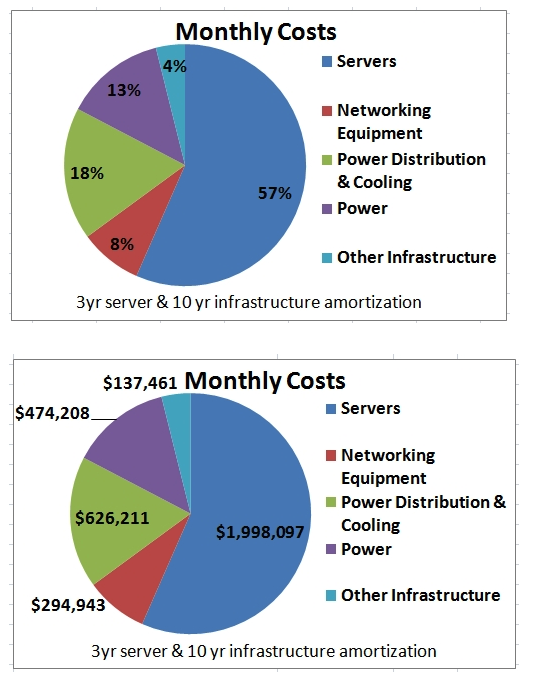

# Cloud Computing

The practice of using a network of remote servers hosted on the Internet to store, manage, and process data, rather than a local server or a personal computer. - Dictionary.com

## Pre Cloud Computing days

- Many companies need to maintain their server to host their own application. This is highly costly for the company in both infrastructure and hiring a good maintainer for the server. Unless you need a massive amount of server, the cost will not justify itself.

### Disadvantage

- Highly costly, rental space, cooling for manpower, server racks, servers, updating hardware when necessary
- Redundant hardware such as servers and power source for backups
- Hosting on a single location results in lower performance, a request from another country will have their network request travel across the world.
- People with highly specialise knowledge.
- Long setup time, if you need a host an application, you need to purchase servers, find a room, setup cooling, set up racks
- High wastage, your server might need to handle the maximum load possible, say supermarket will spike during before a pandemic situation lockdown. You will need lots of powerful servers to handle the load and they will be mostly idle during non-peak period.
- High maintenance, your server need to be up to date with the latest security update.

source from: [Perspectives blog](https://perspectives.mvdirona.com/2010/09/overall-data-center-costs/)

## Benefits of using Cloud Computing

[benefits](https://www.salesforce.com/products/platform/best-practices/benefits-of-cloud-computing/#)

## Properties of Cloud Computing

## Elasticity

- resource should be available on demand
- no long waiting, setup, getting licence

## Simplicity

- With minimum configuration, administrator can set up a new server

## Scalability

- If there is a change in demand, a cloud computing platform can easily spin up new resources and remove then when demand drops.

## Types of cloud computing

### Software As A Service (SaaS)

You create an account and user of the service like an email, Facebook, etc.

You have no control over the servers other than changing user configs and add data that might change value in the database.

### Platform As A Service (PaaS)

You are a software developer wanting to host an application.

You are promised a place in some server you don’t have control over, the server will manage dependencies for you. You need to tell the provider what you want to install.

### Infrastructure As A Service (IaaS)

You are a Dev Ops or IT Administrator spinning up new services, controlling Inbound and outbound traffic. Determine when to scale up or down services.

You have great control over the servers, do anything you want. You will manage the virtual machines, install your desired OS, dependencies, network configuration.

## Lab

Name the number of Service and explain they do

1. Name 5 Saas
2. Name 3 PaaS
3. Name 3 IaaS

## Further Readings

### Comparing different IaaS

[Gartner report](https://www.gartner.com/doc/reprints?id=1-1CMAPXNO&ct=190709&st=sb)
