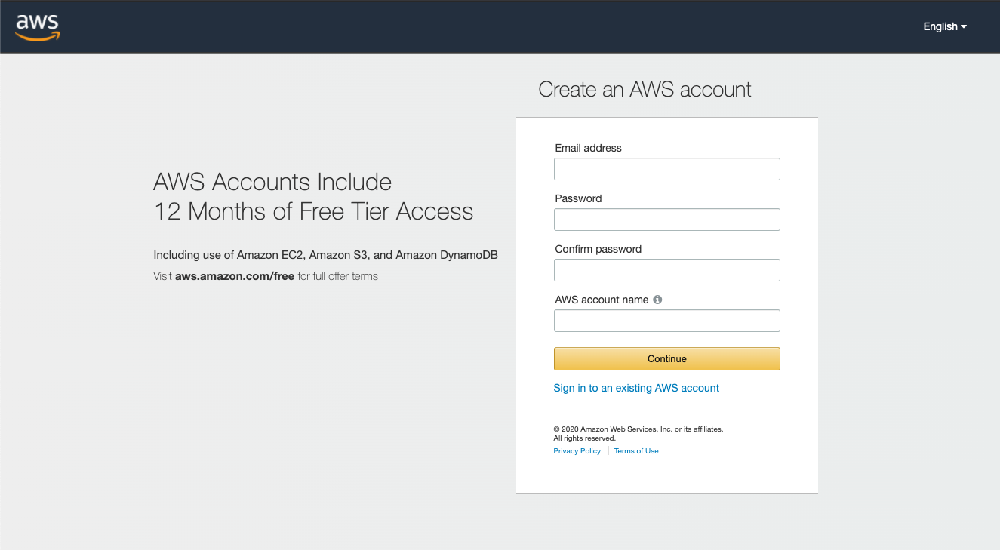
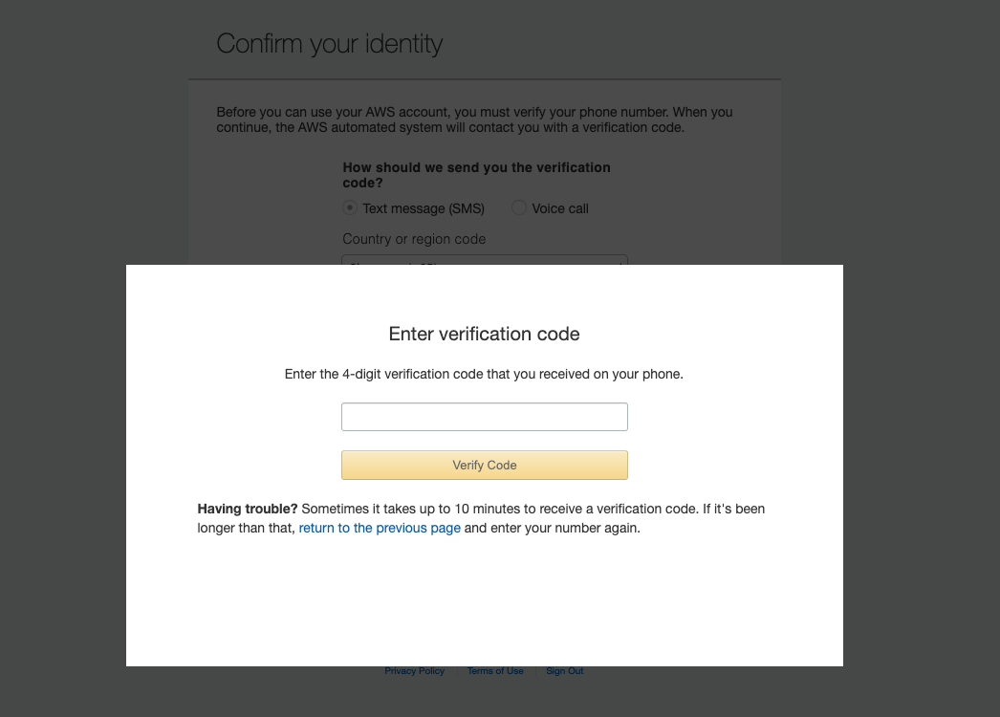
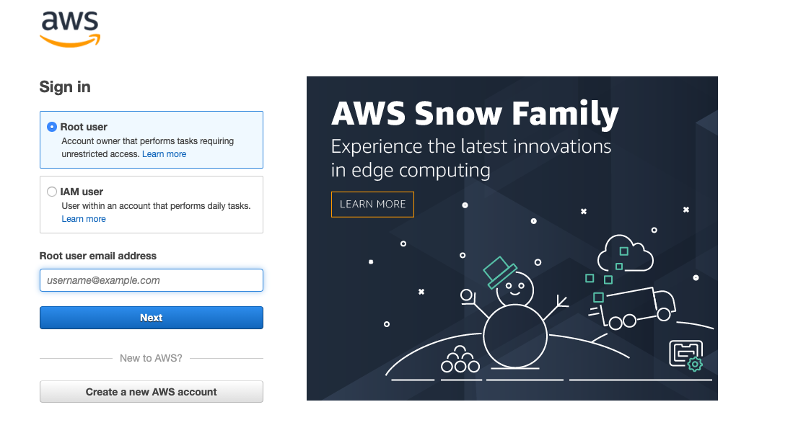
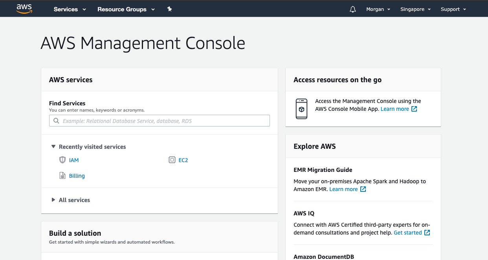

# Creating Account

1. Visit amazon website [here](https://aws.amazon.com/)
2. Click on Create an AWS Account
   

3. Enter Credentials
4. You will need to enter a credit card detail
5. confirm Identity with phone number
   
6. Login as root user
   
7. You should now see the management console
   
