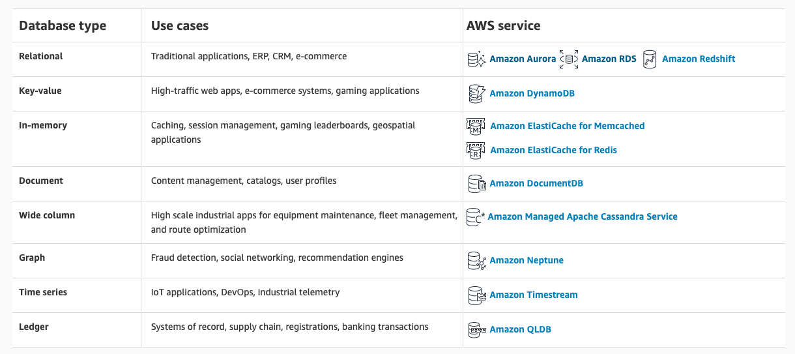
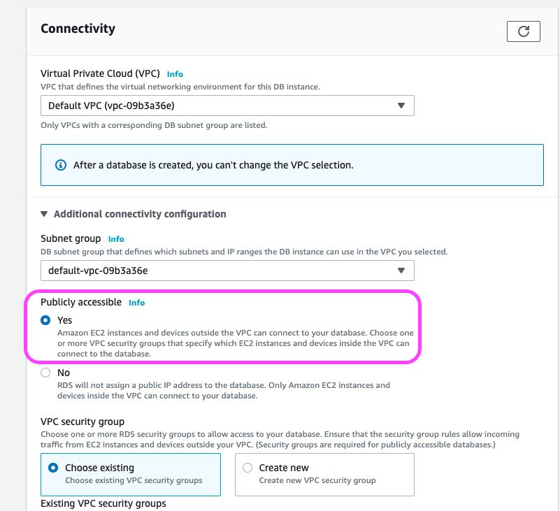
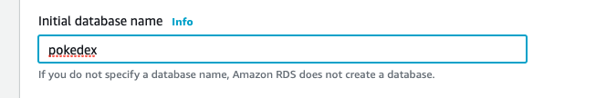
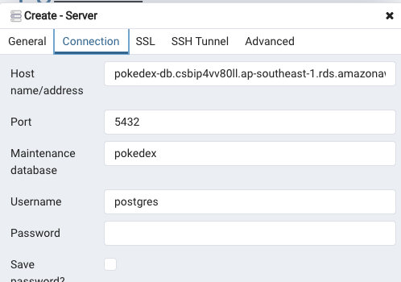

# Database in AWS

AWS provide us with many different type of Database solution. We will cover 2 main type here.

## Common Database found in projects

### Third party databases

- MongoDb => AmazonDocumentDb
- Postgres, MySql, OracleDb => Amazon RDS
- Redis, memcached => ElasticCache

### Amazon proprietary DB

They tend to have better performance(high availability and low latency), auto scaling, replication and backup capability builtin at a disadvantage that you are lockdown to AWS.

- DocumentDb - Key Value store - Have less functionality than MongoDb but can often replace MongoDb
- Aurora - Use RDS behind the scene - a MySQL and PostgresSql compatible relational database.

## Connect to Postgres

- Download PG Admin, https://www.postgresql.org/download/
- Go to RDS
- Create PostgreSQL
- Go to RDS, and create a DB
- Select free tier
- update DB instance Identifier
- enter password
- disable storage autoscaling
- Under Connectivity, select Public accessible
  
- Under Additional configurationm add databasename
  
- create a server in pgadmin
- add the hostname, and database name as Maintainence database
  
