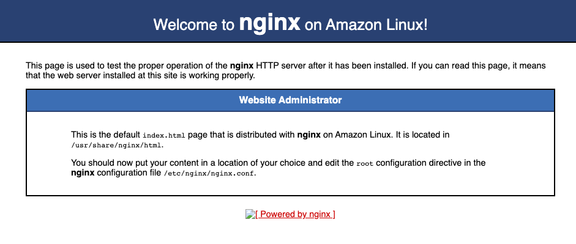

# Elastic Cloud Compute

Amazon Elastic Compute Cloud (Amazon EC2) is a web service that provides secure, resizable compute capacity in the cloud. It is designed to make web-scale cloud computing easier for developers. Amazon EC2’s simple web service interface allows you to obtain and configure capacity with minimal friction. It provides you with complete control of your computing resources and lets you run on Amazon’s proven computing environment. - AWS

Basically, an awesome VM rental service.

## Creating EC2 Instance

### Select Amazon Machine Image

An AMI is a template that contains the software configuration (operating system, application server, and applications) required to launch your instance. - AWS


### Instance Type

After select image, you are required to select the instance type. Each instance type will have a different CPU, Memory, Storage configurations.

- Common Family Type
- General Purpose(t)
- Memory Optimized(r)
- GPU instances (g)

[more info](https://aws.amazon.com/ec2/instance-types/)

### Add stroage

    We can increase and decrease the storage if we need a bigger storage. Typically default is okay.

### Add Tags

Add a tag consist of case sensitive key value pair.

### Security Group

A security group is a set of firewall rules that control the traffic for your instance. On this page, you can add rules to allow specific traffic to reach your instance. - aws

By default all outbound response is okay.

- Type: Common security group type
- Protocol: TCP, UDP
- Port range: which port do you allow
- Source: where ip address can talk to your VM, select anywhere for now.
- Description, for you and other developers to know why you allow the traffic.

### Create a key pair

We can create a private key to connect to the instance.

1. Select `Create a new key pair`
2. Enter `Key pair name`
3. Download Key Pair

As a good practice, we can put the `.pem` file in our `.ssh` folder.


## Connecting to EC2 Instance

### Using Secure SHell(SSH)

First set the right permission to the pem file

```sh
chmod 400 ~/.ssh/<pem-file-name>.pem
```

### finding the public

```sh
ssh -i <pem-file-name>.pem ec2-user@<public ip-address>
```

### finding IP address

The ip address can be found on public IP


When EC2 instance is created for you, the instance will have a private and public IP.

Private IP are IP address in a subnet, not directly connected to the internet, usually hide behind a ISP or a router. The allowable private IP range set by Internet Assigned Number Authrority are:

- 10.0.0.0 to 10.255.255.255
- 172.16.0.0 to 172.31.255.255
- 192.168.0.0 to 192.168.255.255

### Connecting to other type of Images

SSH only works on Mac, Linux and Windows 10, if you don't use either of those, you will faill back to PUTTY.

To connect to a windows image using mac, you will require `Remote Desktop 10 by Microsoft Corporation` downloadable on the Microsoft website or on the App store.

## Public IP will change!!!

When you stop and restart an instance, the public IP will change!!! So you will have to change the IP address when you SSH or If you map your Domain Name Hosting's A Record

### Elastic IP

At additional cost, you can rent an ip address and assign to a EC2 instance. When a instance stop and start, you will get the same IP on the EC2 instance. Most people won't use it.

## Pricing of EC2 Instance

[more on pricing](https://aws.amazon.com/ec2/pricing/)

## Lab 1

1. Create a EC2 instance with Amazon Linux 2 image.
2. Connect to it using SSH
3. Stop the instance and start the instance again
4. SSH to the instance again by changing the public IP

## Run React on AWS

### Nginx

1. Install Nginx

```sh
sudo amazon-linux-extras install nginx1.12
```

2. Starting Nginx

```sh
sudo systemctl start nginx
```

By default Nginx give a startup page. Try hitting the the ip address on the browser and realise that nothing is loaded.

3. Update Security Group

Currently we cannot access the nginx webpage because we are blocking incoming traffic to our EC2 instance. To allow incoming traffic, we need to add inbound rules


after adding the security rule, you should see the nginx page.



### React

1. Install git

```sh
sudo yum install git
```

```sh
git --version
git version 2.23.1
```

2. Git Clone Repo

```sh
sudo git clone <react-repo>
```

3. Install node

Detailed instructions can be found in [aws-developer-guide](https://docs.aws.amazon.com/sdk-for-javascript/v2/developer-guide/setting-up-node-on-ec2-instance.html)

Download Node Version Manager(nvm)

```sh
curl -o- https://raw.githubusercontent.com/nvm-sh/nvm/v0.34.0/install.sh | bash
```

Activate nvm

```sh
. ~/.nvm/nvm.sh
```

Install Node version 12(or the latest LTS version in future)

```sh
nvm install v12
```

Verify installation

```sh
node -v
v12.16.2
```

4. Install and test React package

```sh
npm install
npm run build
npx serve -s build
```

if you have error regarding node not found, this might be because sudo resets its bath on debian based machine for securty reasons.

```sh
sudo env PATH=$PATH npm install
sudo env PATH=$PATH run build
npx serve -s build
```

Now go to `<public ip>:<port>`, example, `http://54.169.47.122:5000`, you should see your app running.

5. Stop Nginx

```sh
sudo systemctl stop nginx
```

6. MV React file to Nginx hosting folder

```sh
sudo mv -f <path to react project>/build/* /usr/share/nginx/html/
```

7. Start Nginx

```sh
sudo systemctl start nginx
```

8. Remove unnecessary port from security group


## Lab 2

1. Publish an React app on port 80 in the EC2 instance you created
2. Publish an Express app on a different EC2 instance.
