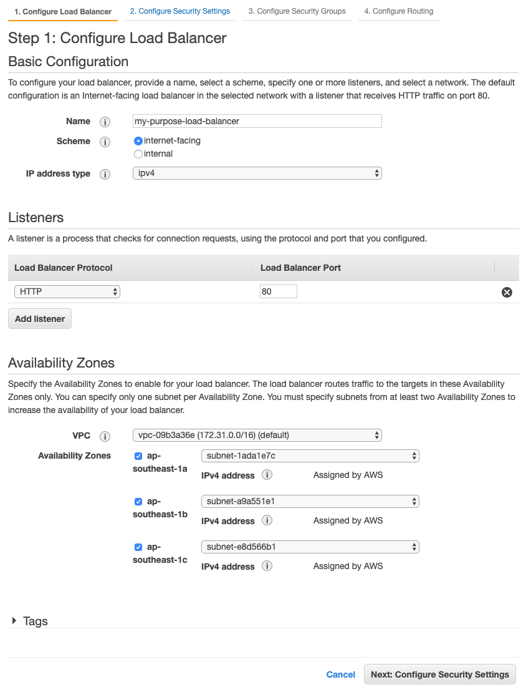
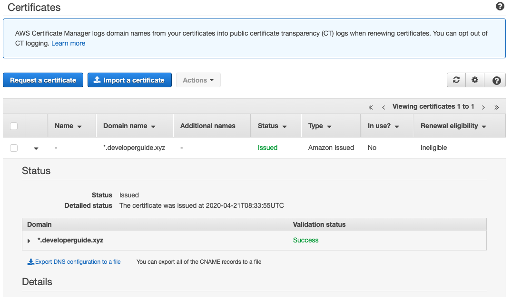
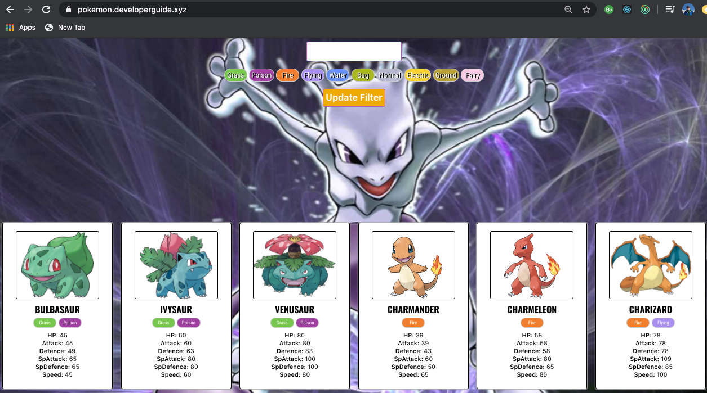
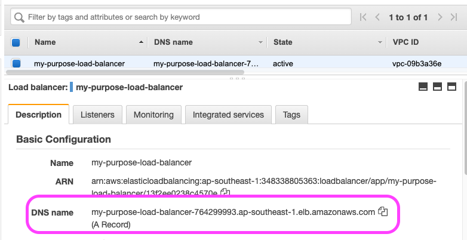

# Elastic Load Balancer(ELB)

Elastic Load Balancing automatically distributes incoming application traffic across multiple targets, such as Amazon EC2 instances, containers, IP addresses, and Lambda functions. It can handle the varying load of your application traffic in a single Availability Zone or across multiple Availability Zones. Elastic Load Balancing offers three types of load balancers that all feature the high availability, automatic scaling, and robust security necessary to make your applications fault tolerant. - [AWS](https://aws.amazon.com/elasticloadbalancing/)

## Main Purpose

1. Distributes incoming traffic across multiple instances
2. Only expose Load Balancer to public, other instances will only talk to the load balancer.
3. Health Check to make sure it routes to services are up

### Other benefits

1. Health Check
2. HTTPS
3. Distrubute across AZs
4. Stickiness

### Client IP

- Application will see the IP of the ELB
- To get Client IP, use `X-Forwarded-for` header
- To get Client Port, use `X-Forwarded-Proto` header
- Cookie will be forwarded for you

### Application Load Balancer (ALB)

- User for HTTP and HTTPS
- Load balance multiple EC2 instances
- Can be configured to have stickiness, meaning the same user will always connect back to the same server if available.

### Network Load Balancer (NLB)

Not covered in this course, but here are some points

- for TCP
- lower latency
- able to handle very high request load

## Setting up ELB

1. Select the load balancer tab and click on `Create Load Balancer` Button

2. Select `Create` on `Application Load Balancer` as we are use HTTP and HTTPS traffic only.

3. Create a new target group. A target group where ELB will redirect the request to. First, we have to create an empty group, we can then later add our EC2 instance in.

Click on "Next"

4. Add instance to redirect, select the EC2 instance you created.

5. Review and Create.

### [Optional] Amazon Certificate Manager(ACM)

By adding PORT 443, it will bring you to a page that allows you to add an ACM which allows you to create a HTTPS certificate. Before you do so, you will need a domain name.

Note that there will be additional charges.

Is fairly straightforward, just go to ACM, put in your domain name, download instructions and verify you are the owner of the domain by changing the CNAME record or by email.

Be sure to make sure the Security group used by the load balancer allows HTTPS.

## connecting to your instance by ELB

To connect to your instance, use the DNS name

Go to the target group and you realise that the Registered targets are marked by their instance ID and not their IP address. This means that if IP changes because you restart or when new instances are created by auto scaling, it will have no problem routing to them.

### Update Security Group to allow only from ALB

To reduce the attack surface of our app, we can change the security group used by the EC2 instance and only allow if routes are from the load balancer and SSH.

## Lab

1. Configure an ELB that points to EC2 instance.
