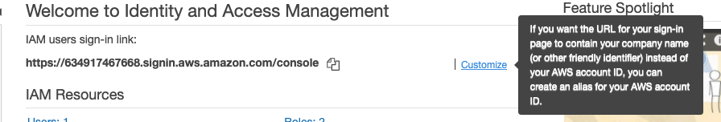
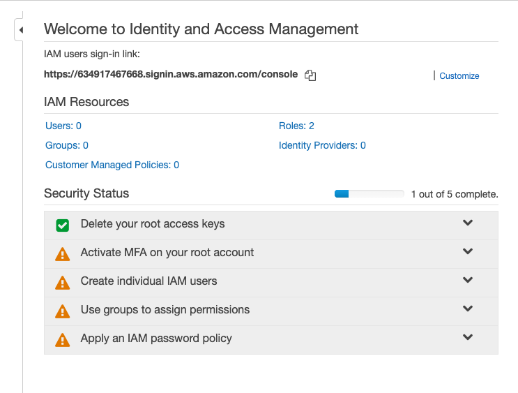
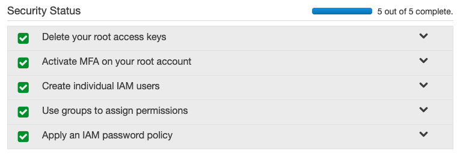

# Identify and Access Management

Enable you to manage access to AWS services and resources securely

[IAM introduction video](https://youtu.be/Ul6FW4UANGc)

## Terminology

### Users

humans that have access to your AWS resources

### Roles

Instances(example EC2) or AWS services that have permission to do actions on your behalf.

### Permissions

Specify if an user role, the group can access an AWS resource and to what extent (Read, Write)

### Policy

A grouping of permissions. There are already default Managed Policies, commonly used policy, that AWS created for you to use.

### Groups

A set of policies/permission that affects multiple users by assigning users to the group.

## Customise IAM users sign-in link

To separate your AWS management console and other's AWS management console, IAM users will have to go to the sign-in link. A 12 digit number represents the sign-in link, makes it distinct and hard to remember. To make it easier for your users, we would typically create an alias for the number. This alias also needs to be unique.

Note that signing in as IAM users and Root uses a different link.

## Setting Up Root Account

When you first create an AWS account, Amazon recommends you to follow certain best practices.

### Delete your root access keys

By default, you don't have a root access key. A root access key is a key that allows you to authenticate yourself as a root user and allow the key holder to do anything to your account. By default, there is no root access key, and you should not create one.

### Activate MFA on your root account

We can set up multiple factor authentication. AWS supports virtual MFA device or [U2F](https://www.yubico.com/authentication-standards/fido-u2f/) Security key.

We can use a Virtual MFA applications. If you don't have one already, I will recommend the Google Authenticator. Download Google Authenticator on your IOS or android device. Click on + and Scan Bar Code. Following the instructions to get the 2 MFA code to finish setup.

- Authy
- Duo Mobile
- LastPass Authenticator
- Microsoft Authenticator
- Google Authenticator

If you are in an environment, you cannot have access to your phone. Request your organisation to get you a U2F key. They are easily available from [Amazon](https://www.amazon.com/stores/page/8E6D7A52-6F69-4A70-A07B-4168A9FD33B0?ingress=0&visitId=4e887182-a088-465f-a4b3-b9f1b06da6a1&channel=SLP_FW_21D9BC02-6DFF-4BD7-A77F-4AE207A2AEFD&liveVideoDataUrl=https://amazonlive-portal.amazon.com/v2). Make sure you don't lose your key.

### Create individual IAM users

Amazon recommend you not to use the root account for day-to-day operations. Instead, create a new IAM user (Even for Admin)

To create an admin user, create a new user and attach the "AdministratorAccess" Policy to the user.

We can tag users based on their job title to organise and search for them easily.

### Use groups to assign permissions

To better organise our users, we can create a group to give the same policies to users that work on a similar task. I.e. admins, developers, product owners.

Previously we created an admin User, After creating the group, under the "Groups" tab > "Group Actions" drop-down, we can add users to the group.

### Apply an IAM password policy

We can enforce a certain strictness to the password our IAM users create. Select "Set Password policy".

[WikiHow - create a password](https://www.wikihow.com/
Create-a-Password-You-Can-Remember)

Or even better, use a password manager and use it to generate a strong password.

You can see a list of popular password manager [here](https://www.tomsguide.com/us/best-password-managers,review-3785.html)

## Other Best Practices

### Use Access Level to Review IAM permissions

Give specific user level such as `List`, `Read`, `Write`, `Permissions management` or `Tagging`

### Do not share access key

- don't share credentials between uses
- do not check in your access key to any repository such as GitHub
- paste your access key and credentials anywhere or to any other users

### Rotate Credentials Regularly

- change your password regularly. Once in every 3 months or more/less frequent depends on how secure you need it to be.

### Remove Unused Credentials

- once the user leaves an organisation or done with the key. Update IAM and remove all users and/or policies that are no longer necessary.

### IAM Web Identify Federation

You can set up cooperate SAML to allow IAM users to AWS account. As this is not a dev ops course, is out of context.

### More on Best Practices

[best practices](https://docs.aws.amazon.com/IAM/latest/UserGuide/best-practices.html)

## Lab

### [optional] Personal Account

1. Setup your own AWS account, you can create an email account and use it to create a new AWS account and close the account if you don't want ot keep it. Required Credit Card.
2. Get all security status green

### Training Account

This is a Follow along lab that requires instructor to share training accounts.

1. Set up Password manager
2. Set up 2FA on Password Manager
3. Sharing account using Password Manager
4. Generating and changing password
5. Successfully Login
