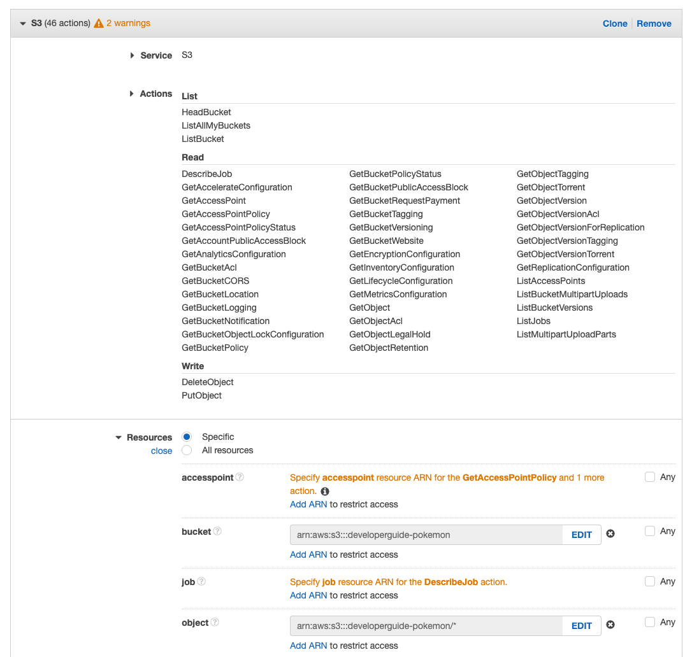
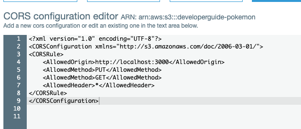
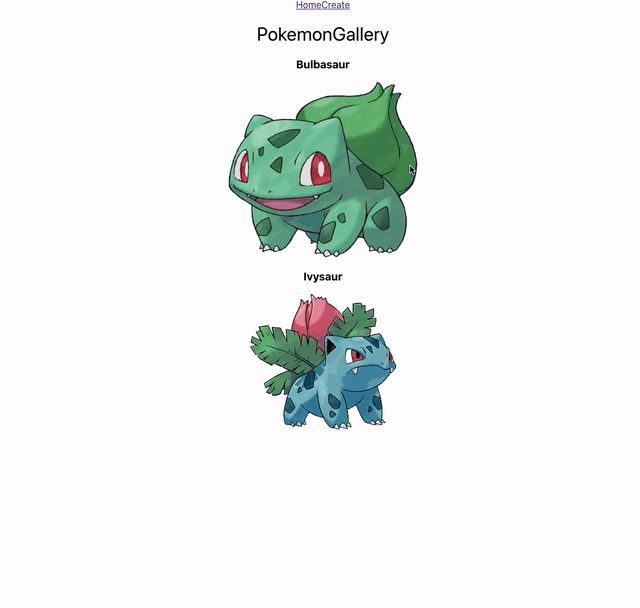

# Uploading image with presigned URL

In this example, we going to look at how we can use AWS SDK to upload images to S3.

## Installing the AWS SDK

In our express application, install the AWS SDK

```
npm install aws-sdk
```

## Authenticating the SDK

We do not want anyone other than applications assigned by us to upload images into our bucket. We also do not want our application to contain more permission than it can do to prevent misused. To do so, our application will need the right amount of permission.

The SDK requires a `AWS_ACCESS_KEY_ID` and `AWS_SECRET_ACCESS_KEY`. `AWS_ACCESS_KEY_ID` helps to identify the user and the permission the user have and the `AWS_SECRET_ACCESS_KEY` authenticates the user.

There are a few ways for you to provide the credentials. In here we will go with setting environment variables. In your While testing our application locally, we can add the ID and KEY to our `.env` file with the credentials after we have created them.

```.env
AWS_ACCESS_KEY_ID=xxxxx
AWS_SECRET_ACCESS_KEY=xxxxx
```

Next, we can create a new Policy.

### Creating a new Policy

1. Go to IAM, under `Access Management`, click on `Policies`
2. Next hit the `Create policy`



Since this bucket is meant to be open to public, we are going to allow our app to do any viewing of data. For writing, we will only allow `putObject` and `deleteObject`.

Be sure to select the bucket using the arn for `bucket` and `object`.

3. Create a Group and assign the newly crenately policy to the group.
4. Create a User with only `Programmatic access` add user into the group.
5. Download the credentials, again, do not share or allow anyone to have these credentials in any way. In you are working in a team with dedicated Dev Ops, this is the credentials that he will give to you.
6. Add the credentials to the `.env`

### Getting pre-signed URL

The AWS SDK Documentation contains all available actions that we can use. Different language will have different SDK and documentation, be sure to look at the correct documentation.

We will be using NodeJs `getSignedUrl`. 
[documentation](https://docs.aws.amazon.com/AWSJavaScriptSDK/latest/AWS/S3.html#getSignedUrl-property)

Below we are only suporting png image. If we want to get a presignedUrl with dynamic image type, we will have to know the `ContentType` before hand and pass in the filename and content type as arguments.

The name of the `object`(file) that will be created is the `Key`. Is common to use form the Keyname in `<user-identifier>/<uuid-v4>.<file-extention>`. In these manner, all user file will be within the same "folder"(s3 don't actually have a folder structure).

```javascript
var s3 = new AWS.S3();

const getSignedUrlInfo = async () => {
  const config = {
    Bucket: process.env.BUCKET_NAME,
    ContentType: "image/png",
    Key: `<object name>.png`,
  };

  const uploadLink = await s3.getSignedUrl("putObject", config);

  return uploadLink;
};
```

We can then create a route to get the url in our Express app

```javascript
router.get("/<route-name>", async (req, res) => {
  const uploadLink = await awsS3.getSignedUrlInfo();

  res.json(uploadLink);
});
```

### Uploading file

We will need a input that takes in a file. Then we store the file in a React `state` which we can have access to later.

```jsx
<input
  type="file"
  accept="image/png"
  onChange={(event) => updateFile(event.target.files[0])}
/>
```

Uploading a file, we first fetch the uploadLink from our express app.
Then we using the `uploadLink` to do a `put` call to push our file to S3.
The location of the image will be stored in the response's `config.url` with user `AWS_ACCESS_KEY_ID` which we can remove away. While having a `AWS_ACCESS_KEY_ID` without the secret won't allow you to do much. In general is still a good practice to reduce attack surface area.

```js
const uploadLink = await axios
  .get(`${process.env.REACT_APP_SERVER_URL}/<route-name>`)
  .then((res) => res.data);

const imageUrl = await axios
  .put(uploadLink, file, {
    headers: { "Content-Type": file.type },
  })
  .then((res) => {
    return res.config.url.split("?")[0];
  });
```

At this point, you should hit a `CORS` Error.

### Fixing the CORS error on localhost

The Cross-Origin Resource Sharing standard works by adding new HTTP headers that let servers describe which origins are permitted to read that information from a web browser. Additionally, for HTTP request methods that can cause side-effects on server data (in particular, HTTP methods other than GET, or POST with certain MIME types), the specification mandates that browsers "preflight" the request, soliciting supported methods from the server with the HTTP OPTIONS request method, and then, upon "approval" from the server, sending the actual request. Servers can also inform clients whether "credentials" (such as Cookies and HTTP Authentication) should be sent with requests. - [MDN docs](https://developer.mozilla.org/en-US/docs/Web/HTTP/CORS)

Here we are going to allow our localhost to trigger a PUT and GET method.

Typically, you won't have to add `GET` as an allow method. To be more explicitly, we will just add both `Get` and `Put`, the 2 method we are going to use when interacting with our Bucket.

Take note that you should not allow `localhost` in anything than the developer environment.

1. Go to S3 bucket
2. Click on Policy
3. Under CORS configuration



## Lab

### In Express

1. Install the `aws sdk` on node is
2. add environment variable `AWS_ACCESS_KEY_ID`, `AWS_SECRET_ACCESS_KEY` and `BUCKET_NAME`. Be sure not to commit the environment variables and NOT to share it.
3. Create a function to get `presignedUrl` from s3.
4. Create a route that returns the `presignedUrl`

### In React

5. Upload the image to S3 and get back the URL in `config.url` use `axios.put` method
6. Call `axios.post` to create a Pokemon with the image URL.
7. Create a separate route on react, in it there should be input box that allow you to create your own Pokemon and attach an image to S3. The image should come back as a card in Pokemon gallery
8. Try Creating new Pokemon, verify the image is on S3 and verify the Pokemon are showing in the gallery.


