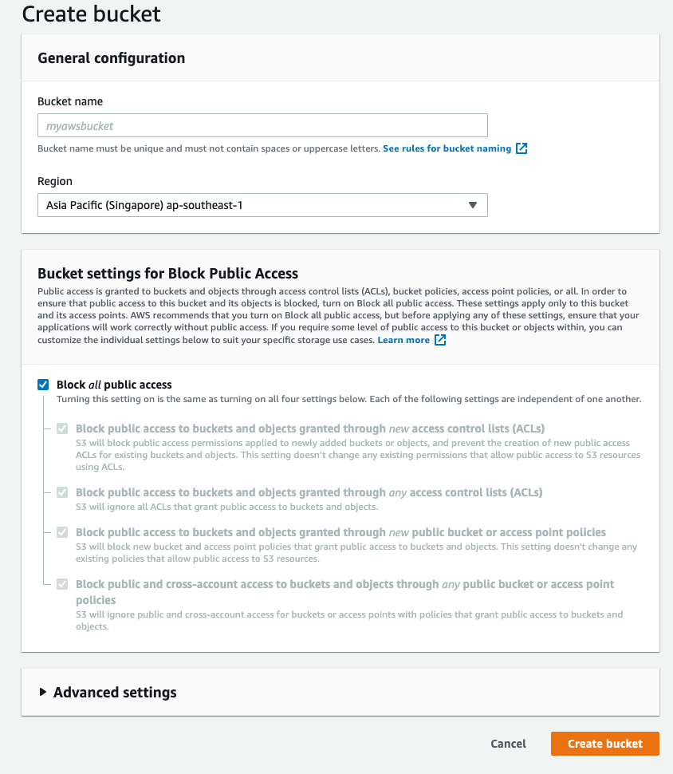
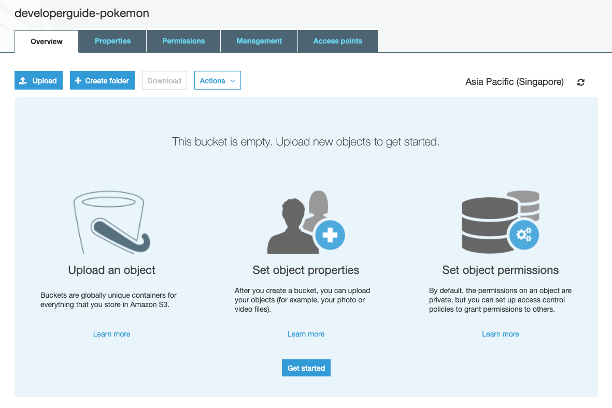
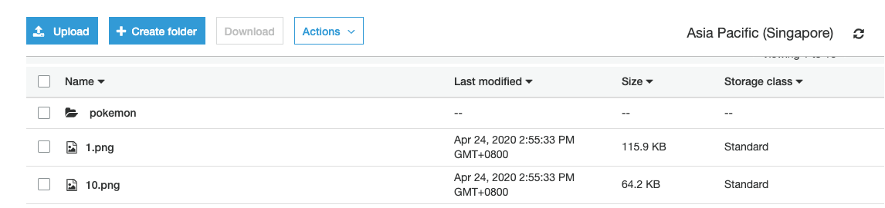
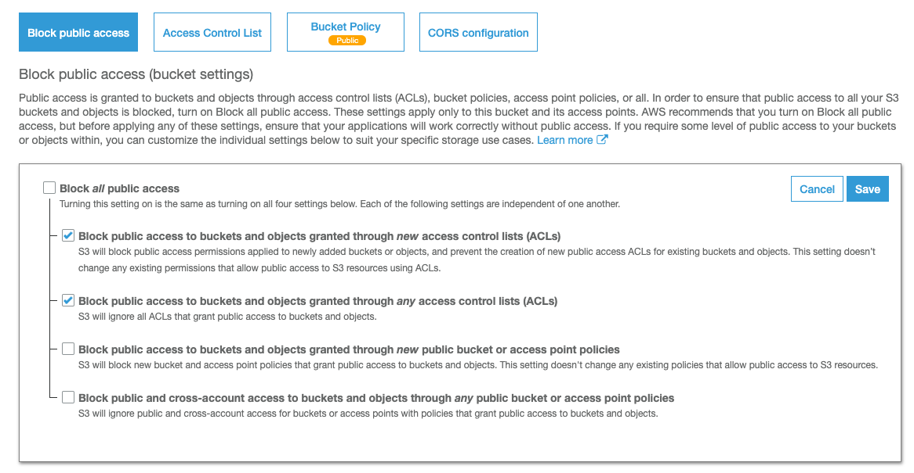
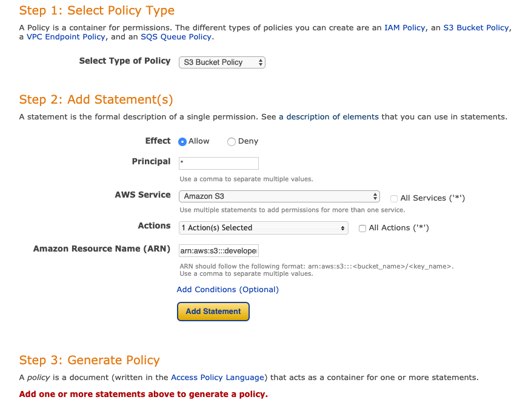

# Amazon S3

Amazon Simple Storage Service (Amazon S3) is an object storage service that offers industry-leading scalability, data availability, security, and performance. This means customers of all sizes and industries can use it to store and protect any amount of data for a range of use cases, such as websites, mobile applications, backup and restore, archive, enterprise applications, IoT devices, and big data analytics. Amazon S3 provides easy-to-use management features so you can organize your data and configure finely-tuned access controls to meet your specific business, organizational, and compliance requirements. Amazon S3 is designed for 99.999999999% (11 9's) of durability, and stores data for millions of applications for companies all around the world. - [AWS S3](https://aws.amazon.com/s3/)

## Terminology

- Bucket: a container for object storaged
- Object: Represents a file such as image, text files. consist if a key, value pair metadata such as last modified and `Content-Type`
- Key: an unique identifier for an object

## Creating a Bucket

Bucket name: has to be unique across all buckets gloablly in any aws acount in any aws region.

- nique across all existing bucket names in Amazon S3
- comply with DNS naming convention
- cannot start with digits, hypen, symbol, punctuation, whitespace
- no uppercase,no underscore
- 3-63 char

We have to specify a region for our AWS Bucket to be stored in, ideally, you will want the bucket to be as close to the user and/or server using the bucket as possible.

Start by blocking all public access



## Upload an objcet

Click on the created bucket to go to the overview page.

The overview page allow you to do CRUD operation on objects.



### Create a folder

Click on the `+ Create folder`, type in the name. Below you can select the encryption settings. Here we can choose `AES-256` or `AWS-KMS`.

Select the `AES-256, Use Server-Side Encryption with Amazon S3-Managed Keys (SSE-S3)`.

Click on Save.

### Try upload some image



Click on the image and try to access the `Object URL`. you should see an error

```xml
<Error>
	<Code>AccessDenied</Code>
	<Message>Access Denied</Message>
	<RequestId>BC22AF112C3B0D09</RequestId>
	<HostId>
	SzsGt09JS5p5rWB6y9fsQUG4ZY59m4VrJwVwOTJtiterFrgVyfVtJsGXjhESwyLWn3hIcQOxOLQ=
	</HostId>
</Error>
```

### Allowing access

We can allow public access to our S3 bucket either by using `Access Control list` or `Bucket Policy`. Bucket Policy is a more popular method that provides control using the policy generator.

First, we need to unblock policies from Bucket Policy Control



Next, Go to the `Bucket Policy` tab and click on `Policy generator`.

Select Type of Policy: `S3 Bucket Policy`
Principal: `*`, means all
AWS Service: `Amazon S3`
ARN: `<arn of your bucket>/*`
Click on Add Statement and Generate Policy



Copy the generated Policy and paste on the Bucket Policy tab.

Revisit the image in S3 and now you should be able to access the image.

## Encryptions

There are 4 common ways to encrypt data in S3. We will look be using SSE-S3.

1. SSE-S3
2. SSE-KMS(FYI)
3. SSE-SE(FYI)
4. Client side encryption(FYI)

### SSE-S3

Good enough for most purpose. SSE-S3 will allow S3 to encrypt the object and the file for us. It will create a unique encryption key, use the encryption key to encrypt the data and store the encrypted data and the encrypted encryption key in our S3.

1. S3 generate encryption key
2. Object + Encryption key => Encrypted Object => bucket
3. Encryption key + S3 managed encryption key => Encrypted Encryption key => bucket
4. S3 will keep the encryption key save.

### SSE-KMS

Use a generated key manage in KMS, very similar to SSE-S3 other than we manage the key in KMS. Use this if want want to change the policy of encryption in KMS.

### SSE-SE

Send object + own encryption key to S3. S3 will then encrypt the object for you and throw away the key. Decryption will be done on client side. You can only use HTTPS and send object via the api calls.

### Client side encryption

You encrypt the file, send it over, and S3 does nothing. Basically no encryption on S3 side.

### Lab

1. Create a new Bucket, don't allow public access
2. Add an image in the bucket and access it using browser
3. Update the bucket policy to allow the image to be viewed
