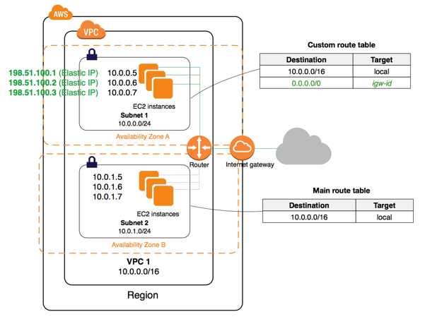
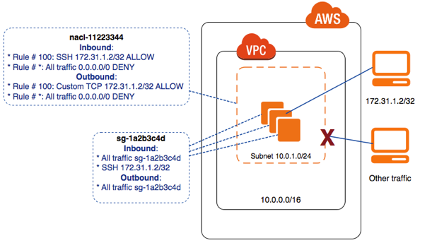

# Virtual Private Cloud

Amazon Virtual Private Cloud (Amazon VPC) enables you to launch AWS resources into a virtual network that you've defined. This virtual network closely resembles a traditional network that you'd operate in your own data center, with the benefits of using the scalable infrastructure of AWS. - [doc](https://docs.aws.amazon.com/vpc/latest/userguide/what-is-amazon-vpc.html)



By Default, Amazon creates a default VPC. Every instance created in AWS needs to be inside a VPC. You can also create a VPC. By creating a VPC, you can isolate all internal instances to other instances.

The prime reason to create your own VPC is for Hardening. Hardening is a process to reduce the surface of vulnerability. The more surface or entry points we allow to our system, the better a chance a hacker can find a loophole to get into our network and instances. Typically, system administrator is the one doing this.

## Creating a VPC


### CIDR block

CIDR stands for Classless Inter-Domain Routing. In our VPC, we have to provide an IPV4 CIDR block. The IPV4 addresses have a maximum of 32bits, `0.0.0.0` to `255.255.255.255`. A CIDR block of `10.2.0.0/16` means we have an IP range of `10.2.0.0` to `10.2.255.255`, around `65536` address available for us to use.

## Subnets

Subnets are a virtual partition that lives within an AZ and VPC.
Each subnet have a route table. A private subnet will have a route table that doesn't have any allowed IP address to its network. A public subnet will have its route table allow incoming traffic from public IPs. Instance in a subnet can talk to an instance of another subnet. You will also have to allocate an IPV4 CIPR block that belongs to a subset of the parent VPC.

For public Subnets, we will also have to auto-assign public IP.


## Internet gateway

An internet gateway is a virtual router that connects a VPC to the internet. - AWS

- create a gateway
- attach to VPC

## Route Table

Determine the traffic flow. By default, we already have a route table created for us when we create a VPC. That will be our main route table, which we will only used to connect to private subnet. We can create another Route table for public subnet.

After we create a route table, we will let our internet gateway know about it by connecting to the internet gateway we created.


update the subnet associate,


After connecting to the route table, we have successfully created a VPC that have a private and public subnet. with the public subnet able to connect to the internet.

## [Optional]Lab

### lab1

1. Create a new VPC with a CIDR block of 10.3.0.0/16
2. Create 2 Subnet, a public and private, in different AZ with CIDR block (10.3.1.0/24, 10.3.2.0/24)

- remember to enable `auto assigned id` on one of the subnet

3. Create an internet gateway and attach to VPC
4. Create a Route Table

- edit routes and map all IP to internet gateway
- edit subnet association to a subnet

5. Try SSH into

### lab2

1. Create an EC2 instance and attach to the newly created VPC on the Public subnet
   We can add an User Data to start Nginx on startup

```
#!/bin/bash
sudo amazon-linux-extras install nginx1.12
sudo systemctl start nginx
```

2. Create another EC2 instance and attach to private IP.
3. add security group configuration to allow internet access on port 80 and ICMP (to allow Ping) on the EC2 Instance
4. Try ping the EC2 instance and private EC2 instance
5. Now try SSH to the public EC2 and ping the private EC2 instance
6. Stop the 2 EC2 instance


## NAT Gateway

Nat gateway allows instances in private subnet to talk to the internet. NAT Gateway allows only outbound traffic (note that is a paid feature).


To create a VPC

1. Attach NAT Gateway to public subnet in the VPC
2. Allocate Elastic IP address

In production, we can shift the instance behind a private subnet and only expose ELB, which prevents SSH or RDP into the computer. Take note that by doing so, if a problem occurs, it might be difficult to troubleshoot.


## Network ACL

A network ACL is an optional layer of security that acts as a firewall for controlling traffic in and out of a subnet. - AWS

Security group acts as a firewall to the instance Network ACL acts as a firewall for a subnet.

You can share Network ACL, one subnet must have one Network ACL, but many subnets can use the same Network ACL.

Unlike Security group, traffic is not stateful. In security group, if you whitelist an outbound traffic, without it listed on the inbound traffic, the reply can go thru the network.



## Common Best practices

1. Put all database and other instances that doesn't require a direct connection to the internet to private subnet.
2. Use a NAT Gateway if you need your instances to update
3. Separate VPC for every environment (Staging, UAT, Prod), if you have constrain to create new VPC, you can separate them to on different subnet.
4. Use Security group for white listing IP
5. Use Network ACL to black list IP
6. Create Security group based on their responsibility (database, web server)
7. Allow your application to run in different AZs
