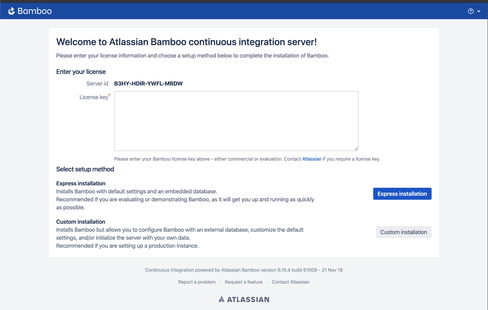

# Installation of Bamboo

## Bamboo Server installation
### Download Bamboo
Download the bamboo server, this package contains the bamboo server, scripts to start and stop the server and all configuration files for customisation. 
1. download bamboo - https://www.atlassian.com/software/bamboo/download

### Install Java 
Bamboo is written in Java and requires Java to be installed to run. 
1. brew cask install adoptopenjdk8
2. find java location: ls -l `which java`
3. Open <BAMBOO_INSTALL>/bin/setenv.sh
- export JAVA_HOME=<JAVA_JDK_HOME> (i.e. export JAVA_HOME=/Library/Java/JavaVirtualMachines/adoptopenjdk-8.jdk/Contents/Home/bin)
- export JRE_HOME=<JAVA_JDK_HOME>/jre (i.e.  export JRE_HOME=/Library/Java/JavaVirtualMachines/adoptopenjdk-8.jdk/Contents/Home/jre)

[check supported version](https://confluence.atlassian.com/bamboo/supported-platforms-289276764.html)

### Set home folder location
1. Create a folder to store bamboo data(i.e. ~/app/bamboo/bamboo-home)
2. In /atlassian-bamboo/WEB-INF/classes/bamboo-init.properties 
    add `bamboo.home=<Bamboo_HOME_LOCATION>`(i.e. bamboo.home=~/app/bamboo/bamboo-home)

### changing starting port
In <Bamboo_INSTALL>/conf/server.xml under "Service", update the "Connecter" property "port" to the desired port number.
```bash
 48         <Connector
 49                 port="8081"
 50                 protocol="HTTP/1.1"
```


## Getting a trial licence

### Create a new gmail account
create new gmail - https://accounts.google.com/signup/v2/webcreateaccount?flowName=GlifWebSignIn&flowEntry=SignUp
i.e. bamboo1231231@gmail.com

### Create an Atlassian account
https://id.atlassian.com/login

### Creating a bamboo account
1. Visit: https://my.atlassian.com/product
2. Click on "New Trial License"
3. Select Bamboo in the dropdown
4. Enter the "Server id" in the "Starting a local bamboo server section"
5. Click on Generate Licence
6. Copy the licence over to the bamboo server

image 

## Running on a server

### Starting a local bamboo server
run `./atlassian-bamboo-6.10.4/bin/start-bamboo.sh`
By default Bamboo open at port 8085, visit http://localhost:8085/
You can change server location by updating the port number in `setenv.sh`.

You should see the image below ask for a bamboo licence

image 
Take note of the "Server id"


