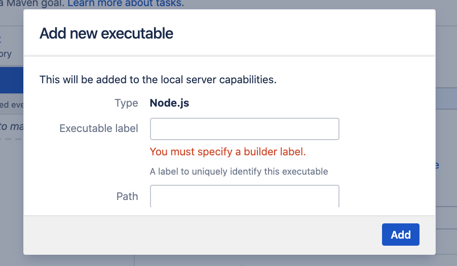
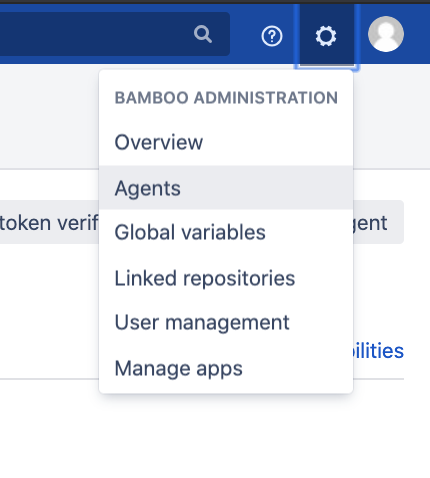
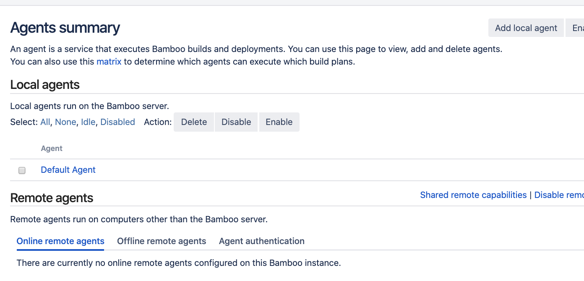
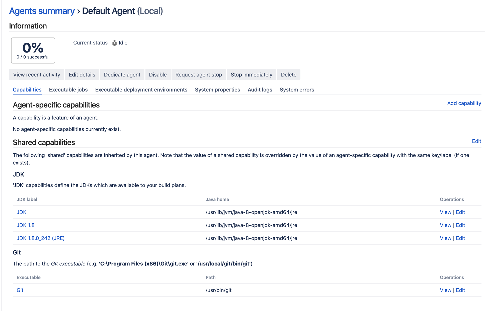

# Build Agent

## Content
1. What is a Build Agent
2. When Build Agent deosn't have the capability.
3. Types of Build Agent
4. Local Agent

## What is a Build Agent
A build agent is responsible for compiling code, running test and everything inbetween to creating a build artifact or deploying your code to the server. 


## When Build Agent deosn't have the capability.
When creating a task, is possible that the available agent does not have the capabilities that you want. For example if you want to use npm and npm is not installed. You will see the following screen. This is because the build agent 



A executable is an external program that bamboo will use to run the application with. For example, bamboo needs git to perform a clone action and npm when installing javascript dependencies. 

To fix the error above, we will have to install node, add an executable label that acts as an identifier and a path to tell bamboo where to find this executable.

## Types of Build Agent
Build agent can be 
- local
- remote
- elastic

To look at agent, go to "Bamboo Administration" and select "Agents".



### Local Agent

By default one local agent is created.



Click in the Default Agent to look at the capabilities.



On mac:
```sh
brew install node@12
```
or Ubuntu:
```sh
curl -sL https://deb.nodesource.com/setup_12.x | sudo -E bash -
sudo apt install nodejs
```

verify the location:
```
which node
```

and add the path of nodejs to path in the executable.

Run the server again to see the green build.


