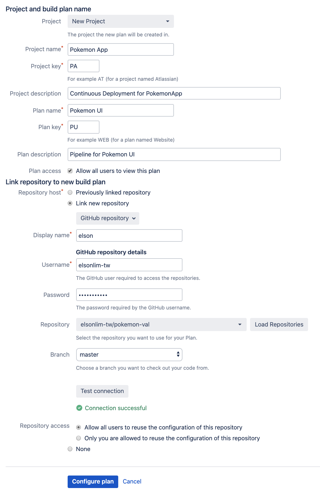
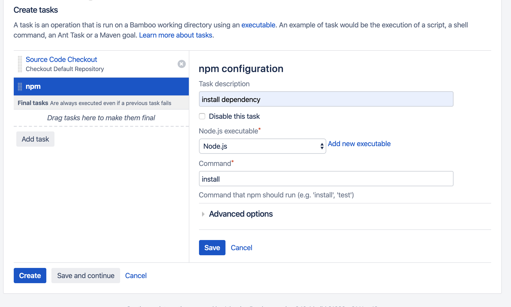
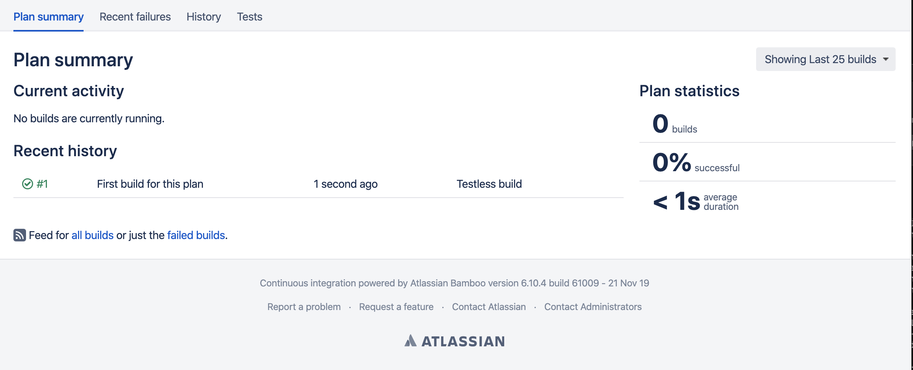

# Creating a Project

We are going to use a demo react app for this page. Any javascript/typescript app will works the same. Click on create project

A project is a collection of plans. You can think of a project as a collection of technologies and services that works together to serve a purpose. For example, a typical project can consist of a user interface and a backend api server. 

A plan will represents a pipeline of one of the services. Each service should be in a individual repository. By configuring the link to the repository, bamboo will be able to checkout the code. 

Is best to create a new user for bamboo and add the user as a github collabroator to give him access to the project. For learning we will skip this step.

After entering user credentials, click on the "Test connection" to check the connected is successful. 

This should bring you to the create task page. 

All task are contain within a job. They will be run sequenctially within the same build agent. Agent are required to have all executable that are required by all the task. 

You can see the Source Code checkout at the very first task. Select the "Add Task" button and choose npm. 

Under the command, type in "install" to run "npm install". The command that installs the dependencies. 

Note that you will need to have node already installed.

Click on "Create" to run the first build.
The build should run successfully. 

