# AWS Code Pipeline

AWS Code pipeline is a continuous delivery service you can use to model, visualize, and automate the steps required to release your software. You can quickly model and configure the different stages of a software release process. Code pipeline automates the steps required to release your software changes continuously. - [AWS](https://docs.aws.amazon.com/codepipeline/latest/userguide/welcome.html)

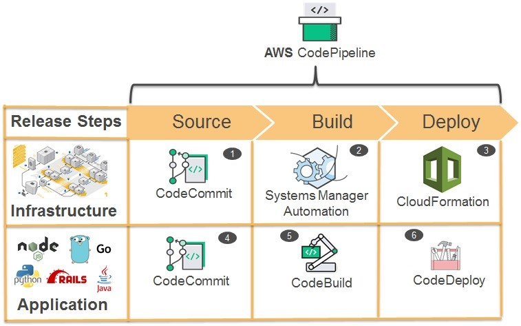

## Overview

We will build a continuous delivery pipeline where when we push our code to Github, it will run test, build and put the files in S3 where we will host our React App.

To achieve this, we will use code pipeline to help us.

1. Pull code from Github
2. Using CodeBuild to run test and build
3. Using CodeDeploy, place the build files to S3.

## Create S3 Bucket for hosting image

Creating an S3 bucket and update the Bucket Policy using the [policy generator](https://awspolicygen.s3.amazonaws.com/policygen.html)

Policy

```json
{
  "Id": "xxxx",
  "Version": "2012-10-17",
  "Statement": [
    {
      "Sid": "xxxx",
      "Action": ["s3:GetObject"],
      "Effect": "Allow",
      "Resource": "arn:aws:s3:::<bucket-name>/*",
      "Principal": "*"
    }
  ]
}
```

## Creating Codepipeline

Create a new pipeline by entering the pipeline name.
Pipeline require a service role with the allowed permission to run CodeBuild and have accesses to require S3 buckets. Pipeline works by having multiple stages and in between stages, the pipeline will pass files generated on the previous stage to the next using S3. These files are artifacts.

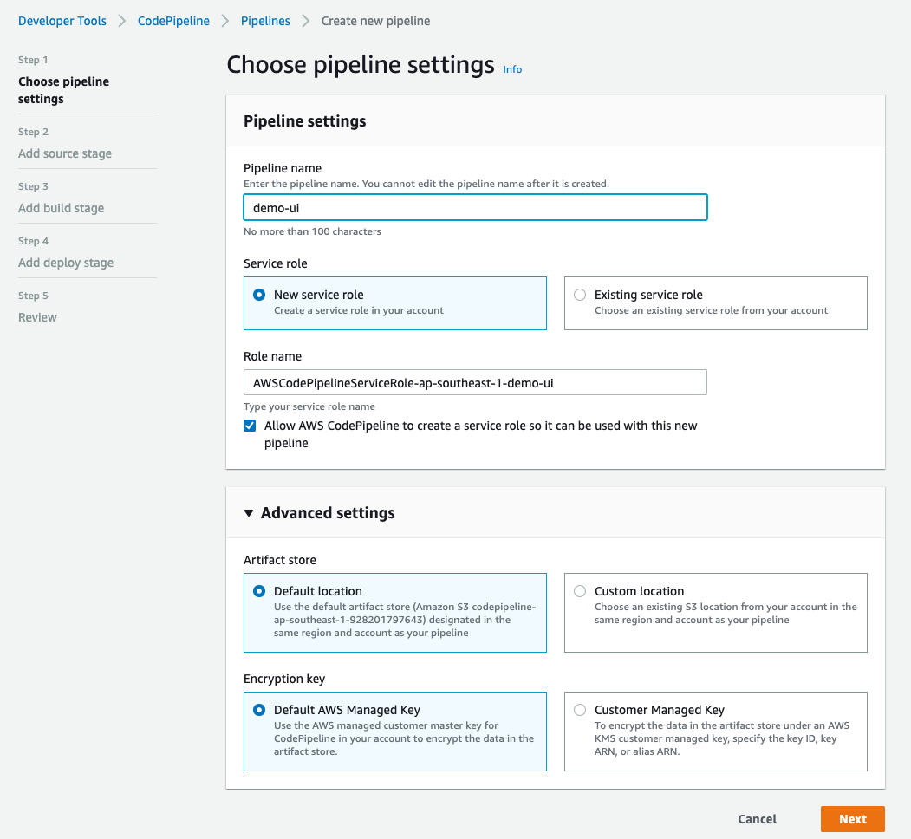

## Supported Source

AWS Codepipeline supports pulling source code from

1. AWS CodeCommit
2. Amazon ECR
3. Amazon S3
4. BitBucket(beta)
5. Github

### React App

We will create very simple React app for this demo and push to GitHub.
Here we will printout the environment variable.

```jsx
import React from "react";
import "./App.css";

function App() {
  return (
    <div className="App">
      <h1>Code Pipeline Demo</h1>
      <h1>
        ServerUrl from env:{" "}
        {process.env.REACT_APP_SERVER_URL || (
          <span style={{ color: "red" }}>undefined</span>
        )}
      </h1>
    </div>
  );
}

export default App;
```

### adding source

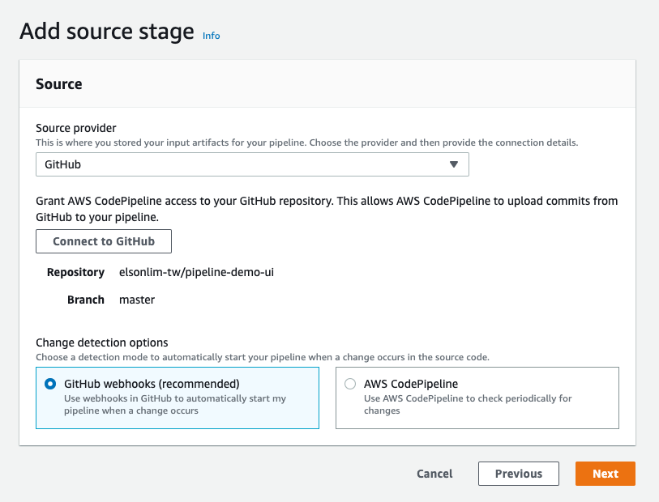

## CodeBuild

To run our test and build, we will use CodeBuild. Which is like Jenkins or Bamboo.

Adding a build pipeline

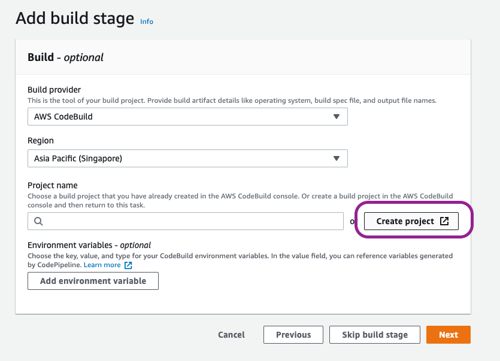

Below, we select the AWS AMI 2.0 OS with the standard 3.0 image.
These images support most popular languages including Node.js 12.
To check language support can visit the link below.
[Supported Runtime Environment](https://docs.aws.amazon.com/codebuild/latest/userguide/build-env-ref-available.html)

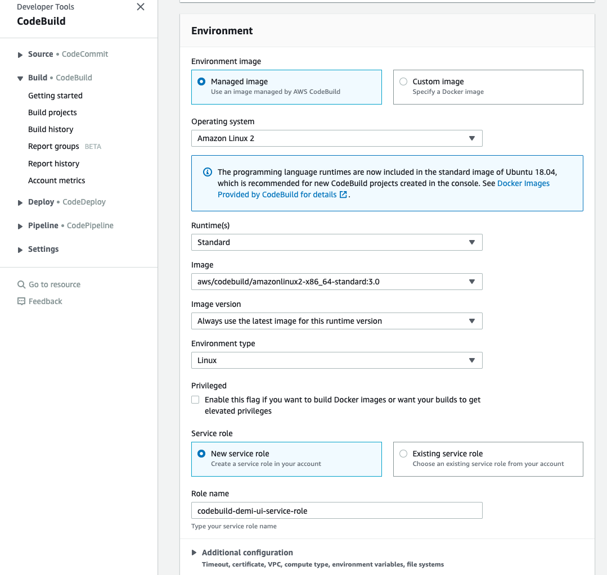

## Configure Deploy

1. Select the created S3
2. Click on Extract file before Deploy to unzip the file showing the static files for React

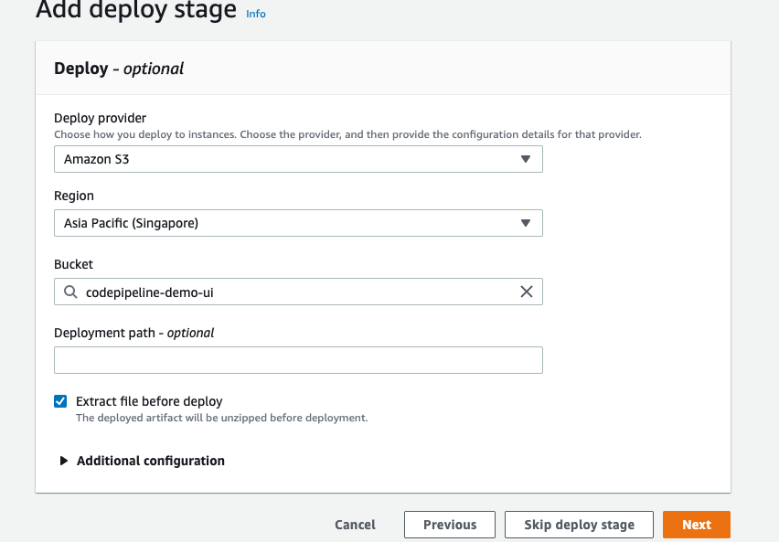

Click next and finish setting up the pipeline

## Adding Buildspec.yml

The deployment will fail, this is because we haven't add in instruction to tell how to build our files.

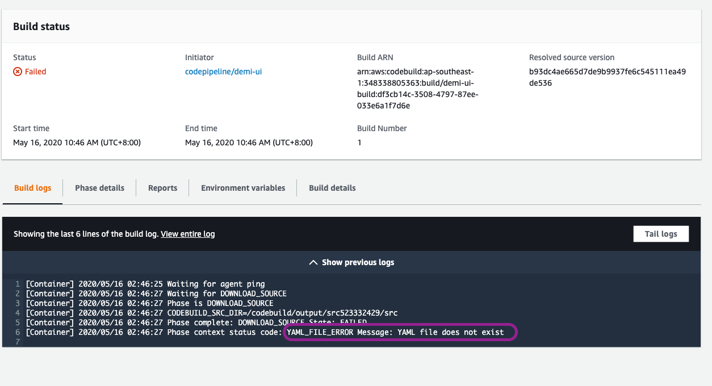

### Creating a `buildspec.yml`

Learn more about buildspec [here](https://docs.aws.amazon.com/codebuild/latest/userguide/build-spec-ref.html)

- `files`: files specified for artifact
- `base-directory`: only use file in base directory as artifacts.
- `discard-paths`: don't flattern the file path

```yml
version: 0.2

phases:
  install:
    runtime-versions:
      nodejs: 12
    commands:
      - echo "installing"
      - npm install
  pre_build:
    commands:
      - echo "running test"
      - npm run testc
  build:
    commands:
      - echo "building artifacts"
      - npm run build
  post_build:
    commands:
      - echo "post build... not doing anything here"
artifacts:
  files:
    - "**/*"
  discard-paths: no
  base-directory: build
```

Checklist

- make sure test are passing
- add `testc` script `react-scripts test --coverage --watchAll=false`

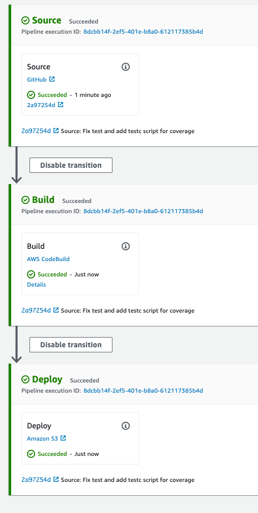

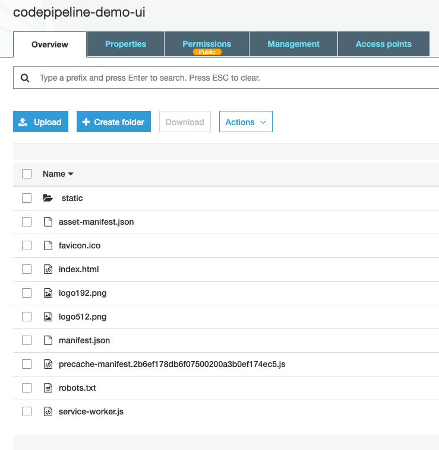

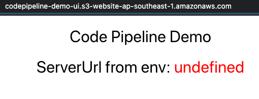

## Adding environment variable

Go to code build and configure the environment. React app add environment while building, this means we need to configure the environment variable in the environment we do `npm run build`. Here, within the container inside CodeBuild.

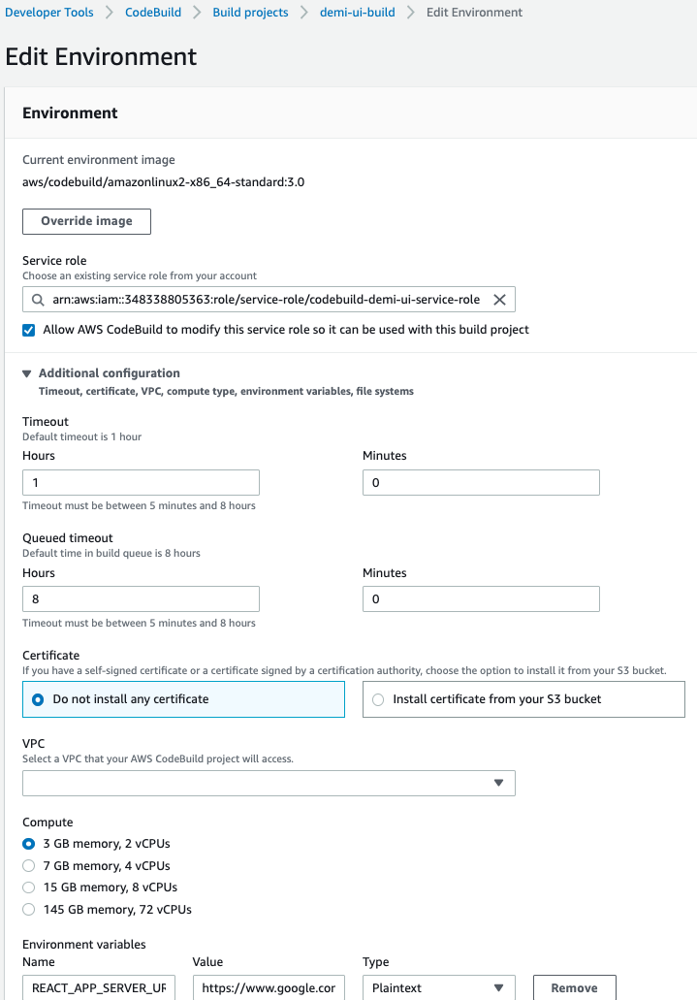

Re-trigger the pipeline by clicking on the `Release change`.

Visit our website again after the deployment completes, you will be able to see the environment variable printed out.

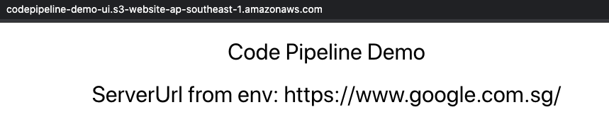

## Adding manual approval step

Going a step further, we can add a new S3 bucket, and configure it similar to the development S3 bucket, say to use for UAT.

Codepipeline allow us to add manual approval

We then add a manual approval step that can allow us to Approve or Reject the push to UAT.

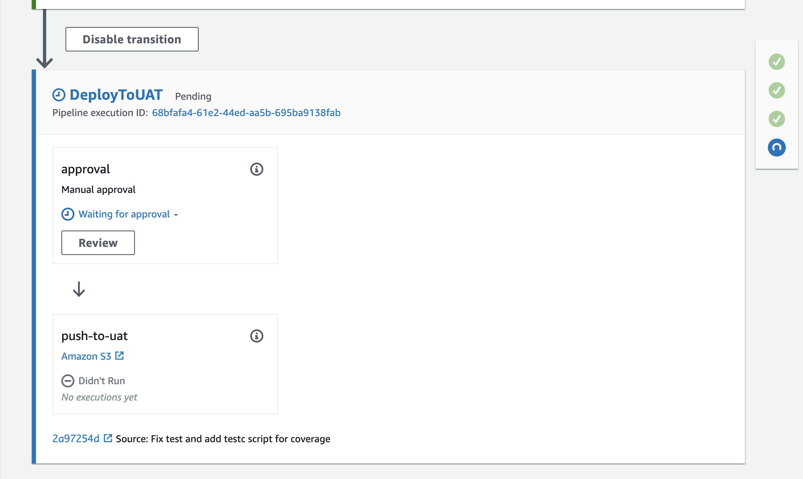

After realising a change, you will have to approve or reject before going to the next part of the stage.
