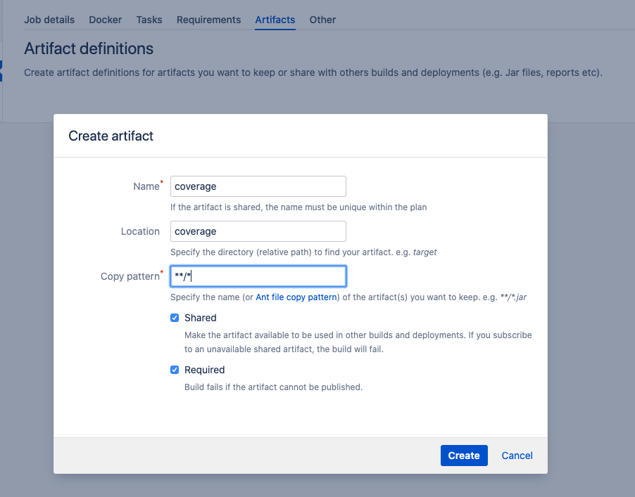
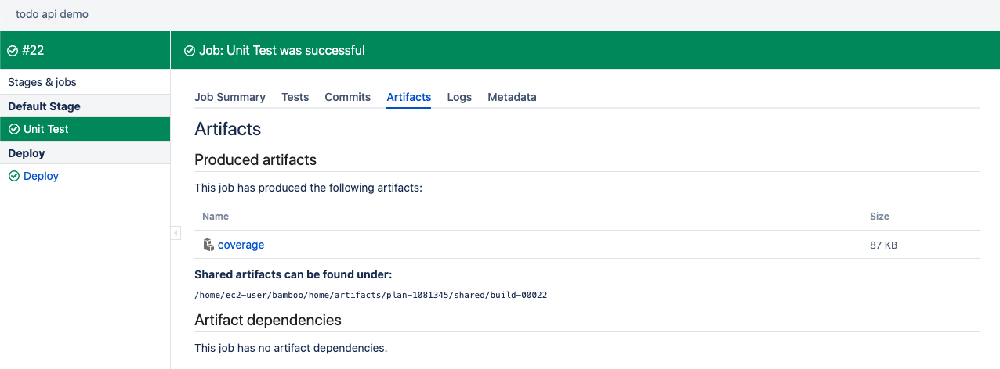
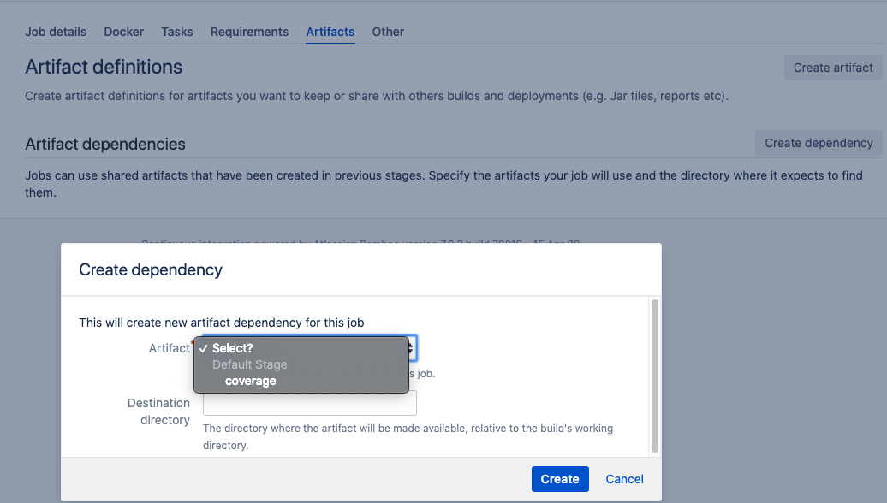

# Artifact

Artifacts are files generated as a result of a Bamboo job. There can be a few reason why we want artifact.

1. Input of another job can be artifact from the previous job
2. You might want to store the generated files somewhere for backup
3. You might want to view the generated files such as test result

All artifact within created by a Job will be avaialble to Stage of the job. All artifact of different Stages will be available to the Plan.

## Creating Artifact

Simply go to the arctifact and specify the path.

After that, you will be able to access the artifact when build is complete.
Under the section, there are 2 chechbox.

- Shared: allow other jobs to gain access to the artifact
- Requried: Will fail the build if failed to create artifact

## Artifact dependency

You can't share artifact acorss Jobs within the same Stage but you can share artifacts on subsequent stages. Once you select the `Shared` when creating artifact you will be able to import the artifacts to the environment running in the stages as a dependency.

