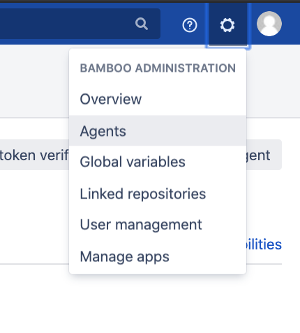
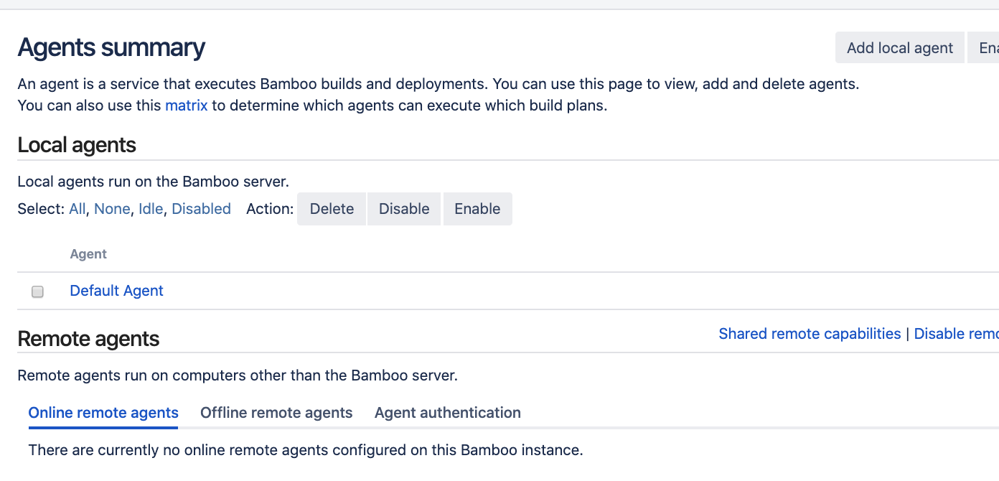
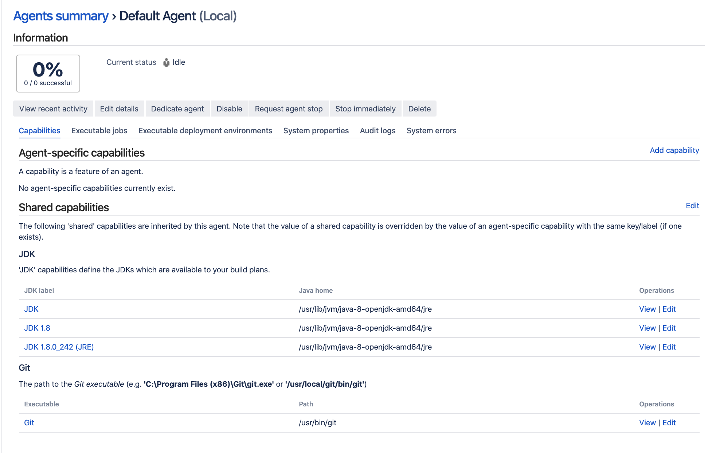
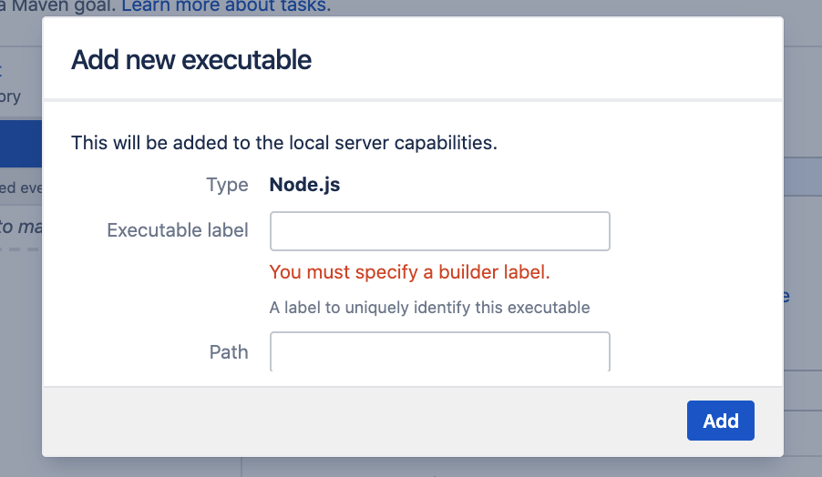

# Build Agent

A build agent is responsible for compiling code, running test and everything inbetween to creating a build artifact or deploying your code to the server.

In this guide we will only go thru setting up local agent.

## Content

1. Types of Build Agent
2. Local Agent

## Types of Build Agent

There are 3 types of

- local
- remote
- elastic

### Local Build Agent

Shares the same processor and memory as the bamboo server.

Pros:

- good for learning
- handling infrequent builds that are fast to complete
- utilise processing power of the server if the server is powerful

Cons:

- can slow down the bamboo server
- queue for build can be long
- can be very slow when there is not enough processing power or memory

### Remote Build agent

Delicated machine external to the bamboo server
Pros:

- Fastest of 3 agent type
- External from the bamboo server makes it more reliable and easy to restart

Cons:

- Expensive
- setup takes time and can be tricky

### Elastic server

Pros: - Only spin up instance when required.
Cons: - limited to AWS

To look at agent, go to "Bamboo Administration" and select "Agents".



### Local Agent

By default one local agent is created.



Click in the Default Agent to look at the capabilities.



### When Build Agent deosn't have the capability.

When creating a task, is possible that the available agent does not have the capabilities that you want. For example if you want to use npm and npm is not installed. You will see the following screen. This is because the build agent



A executable is an external program that bamboo will use to run the application with. For example, bamboo needs git to perform a clone action and npm when installing javascript dependencies.

### Adding capabilities

To fix the error above, we will have to install node, add an executable label that acts as an identifier and a path to tell bamboo where to find this executable.

On mac:

```sh
brew install node@12
```

or Ubuntu:

```sh
curl -sL https://deb.nodesource.com/setup_12.x | sudo -E bash -
sudo apt install nodejs
```

verify the location:

```
which node
```

and add the path of nodejs to path in the executable.

Run the server again to see the green build.
