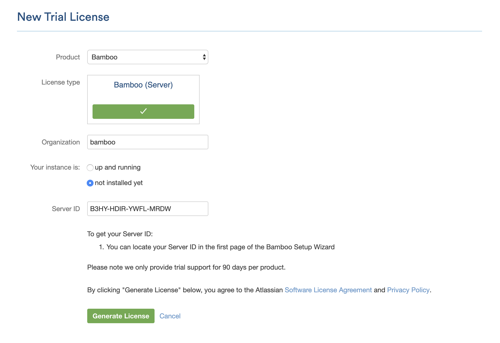
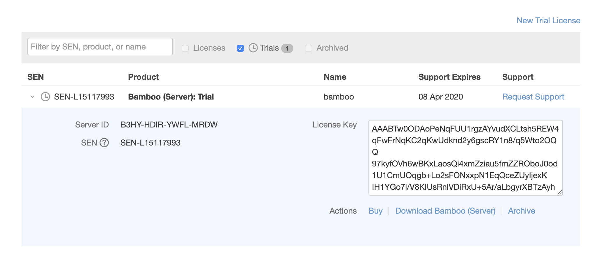
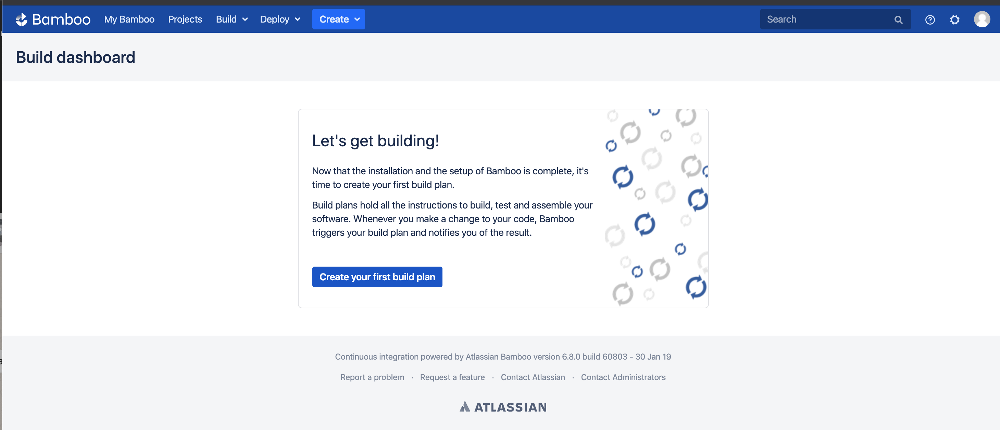

# Installation of Bamboo on Mac

## Content
1. Installing Bamboo Server 
2. Running Bamboo Server

## Bamboo Server installation

### Download Bamboo
Download the bamboo server packfrom from the atlassian website.
The downloaded package contains bamboo server, scripts to run bamboo and other configuration files.

1. download bamboo - https://www.atlassian.com/software/bamboo/download
2. Move the downloaded folder to Documents directory or whereever you prefer, we will address where you put the folder as **<BAMBOO_INSTALL>**

### Install Java 
Bamboo is written in Java and requires Java to be installed to run.
Bamboo requires java 8 to run.
1. Download Java
```bash
brew tap adoptopenjdk/openjdk
brew cask install adoptopenjdk8
```

2. find where is java installed:
```bash
ls -l `which java`
```

3. Let bamboo know which java version do you want to use.
- Open <BAMBOO_INSTALL>/bin/setenv.sh

```
JAVA_HOME=<JAVA_JDK_HOME>
JRE_HOME=<JAVA_JDK_HOME>/jre
```

example:
```bash
export JAVA_HOME=/Library/Java/JavaVirtualMachines/adoptopenjdk-8.jdk/Contents/Home/bin
export JRE_HOME=/Library/Java/JavaVirtualMachines/adoptopenjdk-8.jdk/Contents/Home/jre
```

[check supported version](https://confluence.atlassian.com/bamboo/supported-platforms-289276764.html)

### Set home folder location
1. Create a folder to store bamboo data(i.e. ~/app/bamboo/bamboo-home) we will call this location **<BAMBOO_HOME>**

2. We need to tell bamboo where we want to store our data
- In */home/ubuntu/bamboo/atlassian-bamboo-6.8.0/atlassian-bamboo/WEB-INF/classes/bamboo-init.properties*

```bash
bamboo.home=<BAMBOO_HOME>
```

example:
```bash
bamboo.home=/Users/Alice/Documents/app/bamboo
```

### Changing the Starting Port
By default, bamboo starts at **8085**, if you want to change the behavior, forexample change to 80(default http) or 8081, you can do so in `<Bamboo_INSTALL>/conf/server.xml`.

In the file, under "Service", update the "Connecter" property "port" to the desired port number.
```bash
 48         <Connector
 49                 port="8081"
 50                 protocol="HTTP/1.1"
```

## Running on a server

### Starting a local bamboo server
Run `<BAMBOO_INSTALL>/atlassian-bamboo-6.10.4/bin/start-bamboo.sh`

Visit `http://localhost:8085/` on any [supported browser](https://confluence.atlassian.com/bamboo/supported-platforms-289276764.html#Supportedplatforms-Webbrowsers) of your choice.

You should see the image below asking for a bamboo licence.

image 

Take note of the `Server id`, we will need it when generating a licence.

### Create a new gmail account
We are going to signup for a free tier account using a new gmail account.

create new gmail: https://accounts.google.com/signup/v2/webcreateaccount?flowName=GlifWebSignIn&flowEntry=SignUp

i.e. bamboo1231231@gmail.com

### Create an Atlassian account
Using the newly created gmail account, we can create a new atlassian account that allow us to create free trial account within 30 days. 

https://id.atlassian.com/login

select the `continue with Google` option and signin.


### Creating a bamboo account
Visit: https://my.atlassian.com/product
2. Click on "New Trial License"



3. Select Bamboo in the dropdown
4. Enter the "Server id" in the "Starting a local bamboo server section"
5. Click on Generate Licence
6. Copy the licence over to the bamboo server



After entering the bamboo licence you should able to proceed. 

Click on `Express installation` to create Bamboo in local environment. 




