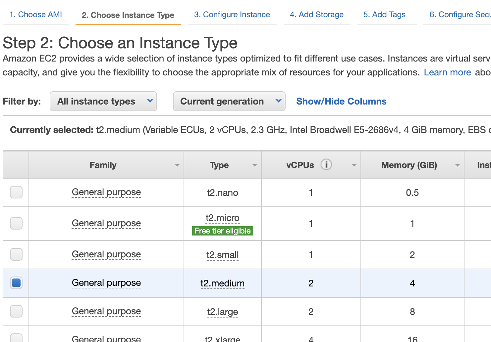

# Install Bamboo on EC2 instance

This page covers the basics setup to create a bamboo server on an EC2 instance connecting to an external db. It will not cover server hardening.

## Content

1. Creating a Postgres instance
2. Create an EC2 instance to host bamboo
3. Configure Bamboo
4. Start bamboo server with external DB

## Creating a Postgres instance

1. Go to AWS console
2. Select RDS
3. Select "Create database"
4. Selected PostgresSql


Use PostgresSQL 10.11-R1, Bamboo support to version 10. [check supported version](https://confluence.atlassian.com/bamboo/supported-platforms-289276764.html#Supportedplatforms-Databases)

Under Credential Settings

- Enter Mastername and password.
- instance: t2 micro
- VPC: default vpc or create a new vpc
- Password authentication
- In connectivity, set `public accessible` raido button to yes
- In Additional Configuration, add the `initial database name`


continue to create the database

## Create an EC2 instance to host bamboo

Create a ubuntu instance


Select t2.medium



Using t2.medium is below the recommended stats but just enough to run a server for learning (t2.micro doesn't have enough memory for JVM)


[for more information on system requirement](https://confluence.atlassian.com/bamboo/bamboo-best-practice-system-requirements-388401170.html)

- select the same VPC as the hosted database
- select the inbound rules to allow all traffic from the port that bamboo will be hosted


The instance will take awhile to be created.

## Configure Bamboo

### connecting to instance

`ssh -i <pem file> <EC2 instance>`

### install bamboo

- after connecting to the instance

```bash
mkdir bamboo
cd bamboo
wget https://www.atlassian.com/software/bamboo/downloads/binary/atlassian-bamboo-6.8.0.tar.gz
tar -xvf atlassian-bamboo-6.8.0.tar.gz
rm atlassian-bamboo-6.8.0.tar.gz
```

- create a home folder for bamboo to store it's configurations

```bash
mkdir home
```

### install java

- after connecting to the instance

```bash
sudo su
apt update
apt install openjdk-8-jre-headless
java -version
```

Java installed location

- jdk: `/usr/lib/jvm/java-1.8.0-openjdk-amd64/bin`
- jre: `/usr/lib/jvm/java-1.8.0-openjdk-amd64/jre`

### configure java

let bamboo know about JDK and JRE location
In `/home/ubuntu/bamboo/atlassian-bamboo-6.8.0/bin/setenv.sh`

```sh
export JAVA_HOME=/usr/lib/jvm/java-1.8.0-openjdk-amd64/bin
export JRE_HOME=/usr/lib/jvm/java-1.8.0-openjdk-amd64/jre
```

### configure home folder

In the file `<BAMBOO_INSTALL>/atlassian-bamboo-6.8.0/atlassian-bamboo/WEB-INF/classes/bamboo-init.properties` add the bamboo home location

```
bamboo.home=/home/ubuntu/bamboo/home
```

### starting the server

start the server `/home/ubuntu/bamboo/atlassian-bamboo-6.8.0/bin/start-bamboo.sh`

Visit `<EC2 Public DNS>:8085` on any [supported browser](https://confluence.atlassian.com/bamboo/supported-platforms-289276764.html#Supportedplatforms-Webbrowsers) of your choice.

## Start bamboo server with external DB

- get licence key from the Atlassian website
- enter the licence key
- select custom installation
- select external database


- select connect via a datasouce
- change localhost to the external postgres url
- enter username and password for database


- follow the instruction to create admin user and you should react the Build dashboard


