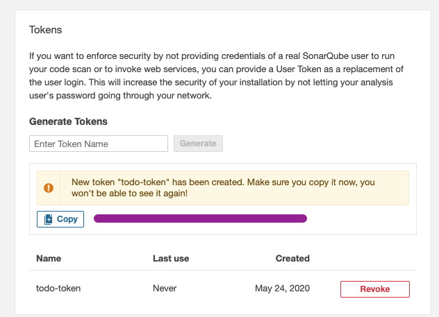
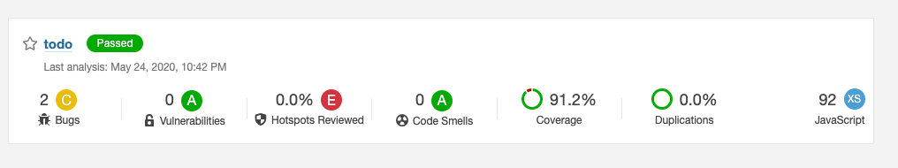
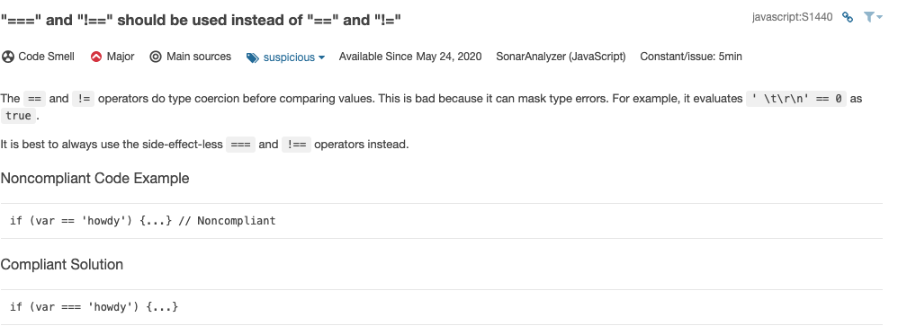
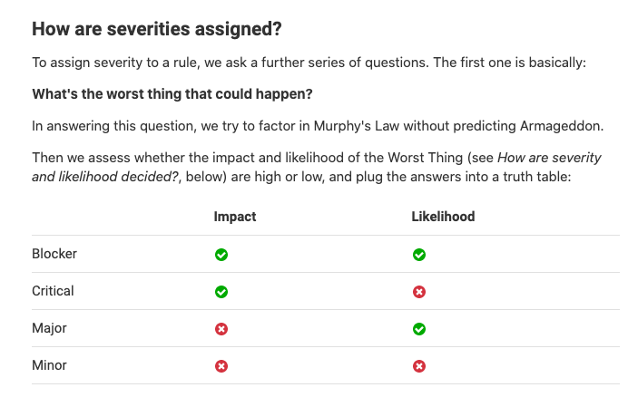
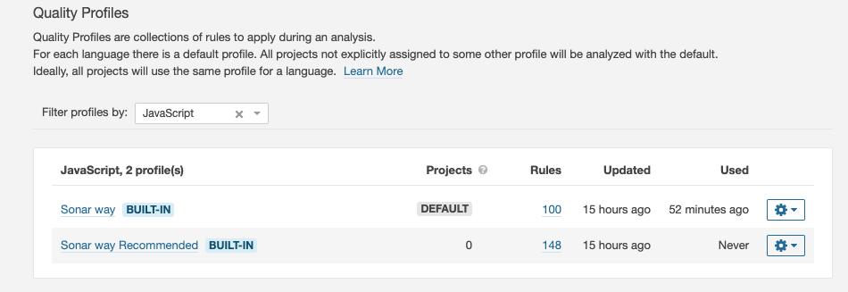
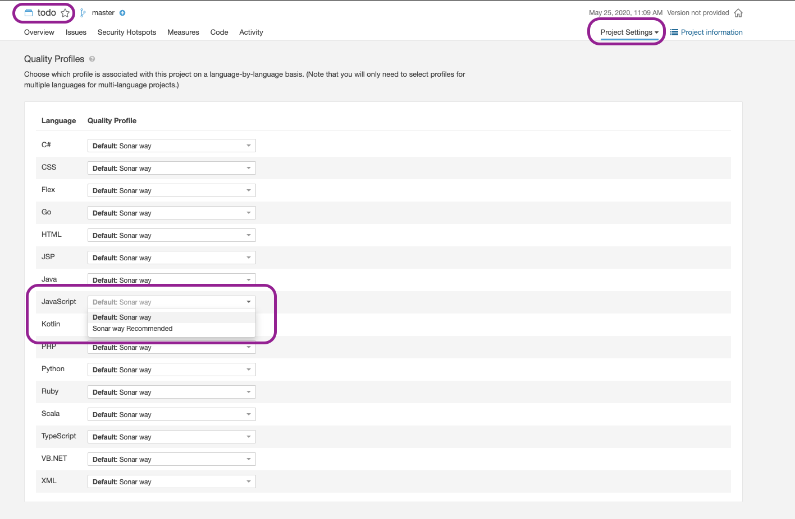
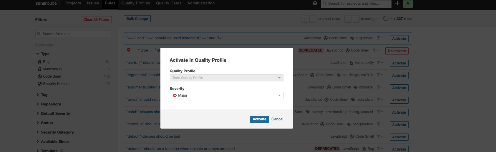
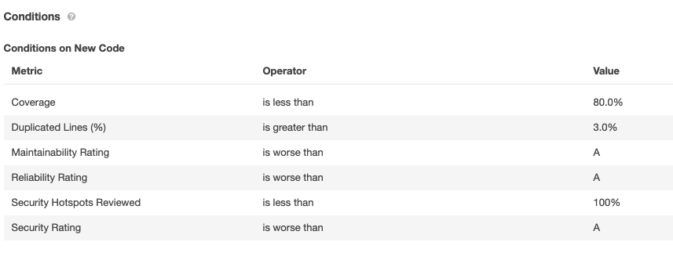
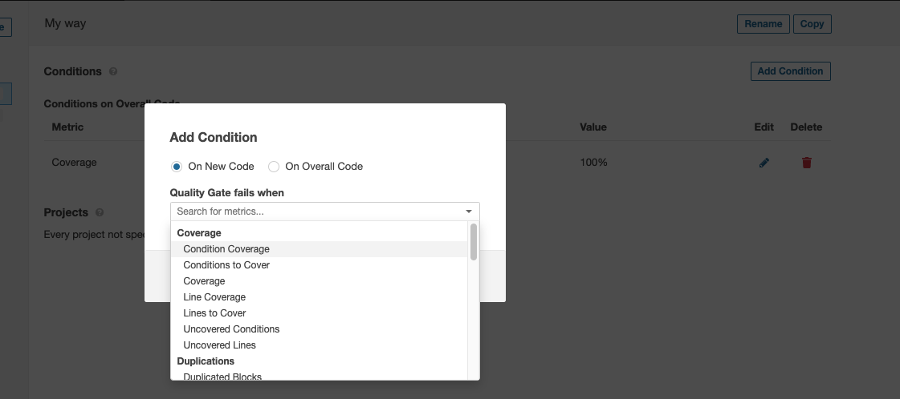
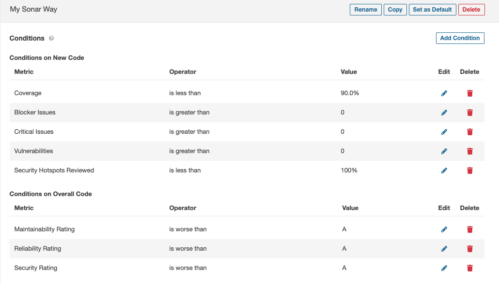

# Sonarqube

SonarQube is a static code scanning tool. Aims to improve code quality and security.
There are multiple versions, we will be using the [community edition](https://www.sonarqube.org/downloads/).


## Checks

1. Bugs
2. Vulnerabilities: codes that doesn't comply to standards
3. Hotspots: code that looks suspicious and should review with more care
4. Code Smells
5. Coverage
6. Duplication

## Setting up SonarQube server locally

### Install locally

1. Install `openjsk-8-jdk-8-jre`
2. Install and download server `https://www.sonarqube.org/downloads/`

### By docker

```bash
docker run -p 9000:9000 sonarqube
```

### Login Details

User: `admin`
Password: `admin`

### Change password

1. Login
2. My Account > Security

## Sonar Client

### Install dependencies

```sh
npm i -D sonarqube-scanner jest-sonar-reporter
```

### Setup test report configuration

Configure jest `jest.conf.js`

```js
module.exports = {
  coverageThreshold: {
    global: {
      branches: 90,
      functions: 90,
      lines: 90,
      statements: 90,
    },
  },
  testResultsProcessor: "jest-sonar-reporter",
};
```

### Tell sonarqube about Project configurations

Setup configuration file `sonar-project.properties`

```conf
sonar.projectKey=todo
sonar.language=js

sonar.sources=src
sonar.sourceEncoding=UTF-8

sonar.exclusions=src/**/*.test.js
sonar.test.inclusions=src/**/*.test.js
sonar.coverage.exclusions=src/**/*.test.js,node_modules/*,coverage/lcov-report/*, src/test-init/*

sonar.javascript.lcov.reportPaths=coverage/lcov.info
sonar.testExecutionReportPaths=test-report.xml
```

### Running SonarQube

1. run test to generate report folder
2. run sonarqube, talk to server
3. Identify your `sonar-server-url` which is likely to be `http://localhost:9000`
   package.json
4. Generate `token`, in sonarqube server, My Account > Security Tab
   

```json
"scripts": {
  "testc": "jest --runInBand --coverage",
  "sonar": "sonar-scanner -Dsonar.host.url=<sonar-server-url> -Dsonar.login=<token>"
}
```

Generate coverage report and run scan

```bash
npm run testc
npm run sonar
```



## Integrating with pipeline

If you want to run Sonarqube in build servers, this is typically done using plugins. Most plugins are easy to configure and need to will cost some money.

- [Bamboo Sonarqube Plugin](https://marketplace.atlassian.com/apps/1212756/sonar-for-bamboo?hosting=server&tab=overview)
- [Jenkins Sonarqube Plugin](https://plugins.jenkins.io/sonar/)

## Terminology

### Rules

Sonarqube have a set of default rules. Each rule specify:

- Type of rule (Code smell, Bug, Vulnerbility
- Severity(Blocker, Critical, Major, Minor, info)
- description of the rule()
- an Noncompliant Code example
- a compliant code example



### Type of severities

We would probably want to block most `Blocker` and `Critical` as they are the one with impact that can cause harm to the system.



[Read More](https://docs.sonarqube.org/latest/user-guide/rules/)

### Quality Profiles

Quality Profiles are collections of rules to apply during an analysis.
You can either assign a profile to a project or the default will be used



You can configure the profile in Project > Project settings > Quality Profiles and select from the dropdown.



You can also configure your own Profile.
Under `Quality Profile` tab, click `Create` button on top right
Click on `Activate More` to add more rules.
You can also inherit from a previous rule set meaning is possible to configure a base set of rules and add more rules depends on your project needs.



### Quality Gates

Probably the most important asepect of sonarqube.

Gate specify the rules for a build.
This will determine if your current build it passed(green) or failed(red)
Quality

Similar to Quality Profile, if no profile is specify, the default is used.



There are 2 section in quality gate.

- `Conditions on Overall Code`
- `Conditions on New Code`

Rules under Overall code will apply for existing + new code.
Rules under New code will only apply for code modified and added.

Creating a new Quality Gateway allow you to customise them


## Lab

1. Setup Sonarqube locally
2. using the `sonar-scanner` pacakge, connect to SonarQube server
3. Setup a SonarQube Quality Gate
   - link to project on step 2


