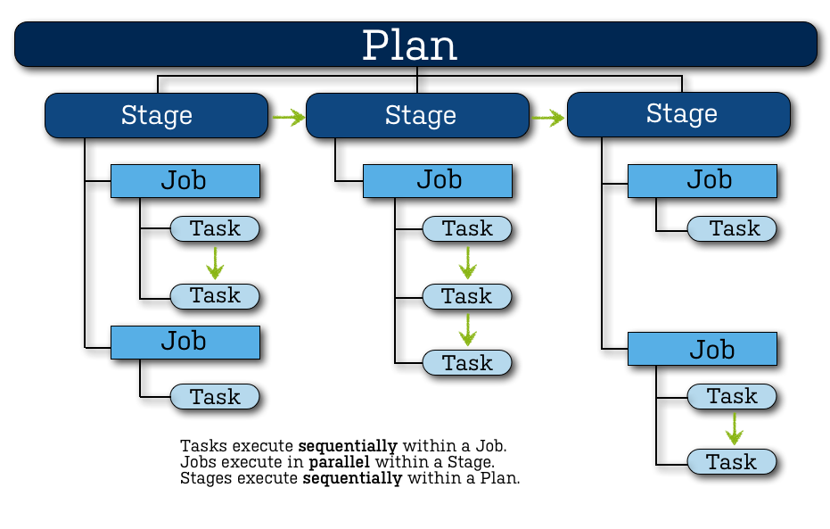

# Introduction to Bamboo

## What is Bemaboo Ci

Bamboo is a Continous Integration(CI) server that automates processes.
This means that Bamboo CI can run code quality checks, automate long and time consuming build and send notification if something fails.

[Read More](https://confluence.atlassian.com/bamboo/understanding-the-bamboo-ci-server-289277285.html)

## Requirements of running Bamboo

1. A server to host the Bamboo Application
2. Installing JDK to the server(Java1.8)
3. A relational Database to store data(H3 default)
4. Additional servers to run Bamboo Agents
5. An Atlassian account to create licence
6. A code repository that contains the project
7. test scripts(unit, e2e, linting, etc...)
8. build scripts to run the automated process

[Read More](https://confluence.atlassian.com/bamboo/bamboo-best-practice-system-requirements-388401170.html)

## Terminology

### Agent

A service that runs job

- each agent need to specify a set of capabilities and can only run jobs whose requirement matches the agent

### Capabilities

Capabilities are executable/software that are installed within the system

### Overview

### Plan

A Plan can be thought as a preprogrammed workflow that will run when an external event happens.

- group a series of stages that can be run
- defines the triggering event
- controls who have access to the configuration.
- add configurations that can be used during any sub stage.

### Stage

A stage controls the behavior of jobs.

- configure jobs to run in sequencial or parallel
- stage to stage runs run sequencially
- all jobs must passed before the next stage can be run
- when the last stage pass, the plan will be considered passed
- when multiple agents are available, stage will schedule jobs in different agents _parallel_

### Jobs

A Jobs runs one or multiple task _sequentially_ on an agent

- specify dependcies that requrie to run the task. (i.e. specify that agent need node to run javascript)
- output artifacts such as build files and coverage report
- each plan will at least have a default job

### Task

Running an action or command such as `npm run test`
