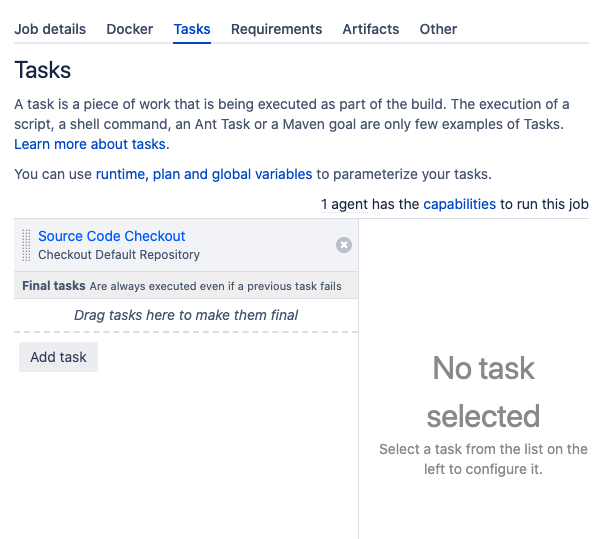
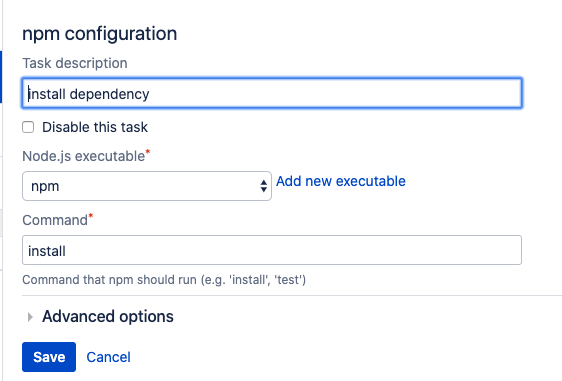
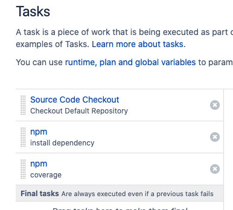

# Test Stage

## Checking out source code

When a project created, Bamboo already created stage `Default Stage`. Select `Add job`, to create a default Job. If you have link Github or BitBucket linked, you will see a `Source Code Checkout` task already create for you.

## Adding new Task

Click on the Add task button, Inside can add a description that will be shown. Choose the executaable(the capabilities/program to run the software) and add in the command you need.

