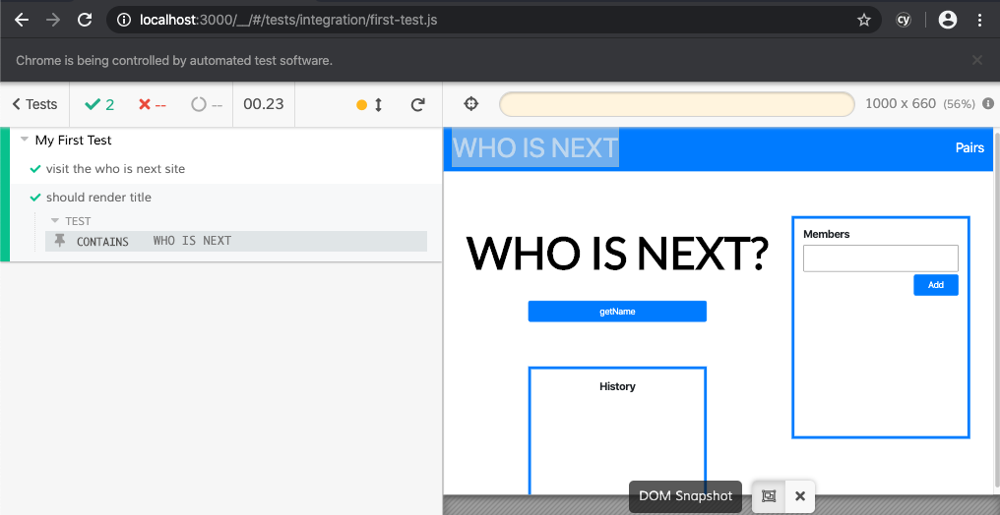

# Creating a cypress test

Create a new file
`cypress/integration/first-test.js`

If you have cypress open, you should see the file in the left runnable window.

1. First add a describe block like in jest

```js
describe("My First Test", () => {});
```

2. We can ask cypress to visit the website we want to visit

```js
it("visit the who is next site", () => {
  cy.visit("http://localhost:3000");
});
```

3. our first test that simplies checks that cypress can find the test

```js
it("should render title", () => {
  cy.contains("WHO IS NEXT");
});
```



## Moving the url out to the environment variable

There are various ways to add environment variables in cypress.
The easiest is thru package.json

Modify the `cy:open` script in package.json

```json
"cy:open": "cypress open --env host=http://localhost:3000"
```

To run cypress on test/prod environment, all we need to do is change the host.

If you have lots of other environment variable, you can also choose to set them in a `cypress.env.json` file. Remmeber to add this file in `.gitignore` and document in Readme.md to help new developers setup their machine.

In cypress.env.json

```json
{
  "host": "http://localhost:3000"
}
```

## Lab

1. Using your personal project, find write a cypress test that visit
