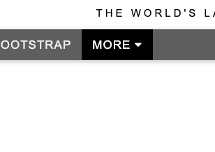
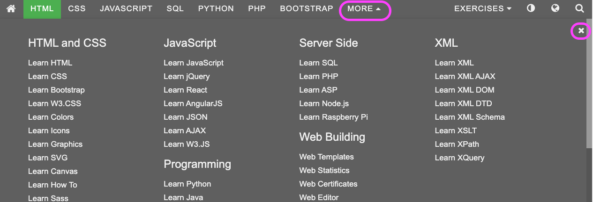

# Interactions and Matchers

## Interaction

Cypress provides us with common capabilities to interact with the elements allow us to click, drag, hover and scroll elements.
In this example, we going to use [w3school learn html](https://www.w3schools.com/html/default.asp) website as an example.

## Clicking on the More button



To click on the "MORE" button, we can use the `click()` button.

```js
cy.get(".w3-bar").contains("MORE").click();
```

## Expecting changes

By default, when we select elements, cypress will already throw an error if the element cannot be found. Cypress allows us to do more detail checking using the `should` command.

When the MORE button is clicked, navigation for the tutorial will appear. The caret icon beside the more will also be inverted. If we want to test the behaviour of this.



First, we can test that the tutorial appear.

```js
cy.get("#nav_tutorials");
```

We can also test only one tutorial appears. The `should` command allowing us to pass in a callback, the argument will be a jQuery element that we can interact with. Using the expect statement, we can check that only 1 element is available. The `to.have.` syntax comes from [mocha](https://mochajs.org/), a lightweight testing framework very similar to [jest](https://jestjs.io/).

```js
cy.get("#nav_tutorials").should((nav) => expect(nav).to.have.length(1));
```

The caret orientation is 2 different elements. By toggling the `display` value between `inline` and `none`, it creates the toggling effect.

The only thing changes in the caret are the CSS property so that is what we are going to test.

We look for the MORE button, to have sibling elements, we need to navigate back to the parent and use `find` to find one matching element. Then we use `.should("have.css", "display")` to check if the style is applied,

```js
cy.get(".w3-bar")
	.contains("MORE")
	.parent()
	.find(".fa-caret-down")
	.should("have.css", "display")
	.should("eq", "none");

cy.get(".w3-bar")
	.contains("MORE")
	.parent()
	.find(".fa-caret-up")
	.should("have.css", "display")
	.should("eq", "inline");
});
```

## Lab

1. Create a new cypress project and complete the workflow below

```js
describe("Lazada", () => {
  it("visit website", () => {
    cy.visit("https://www.lazada.sg/");
  });

  it("click on 'Electronic Devices'", () => {});

  it("click on 'Tablets'", () => {});

  it("select Apple icon", () => {});

  it("Select Apple iPad Pro Wi-Fi + Cellular 11-inch", () => {});

  it("select 256GB Size", () => {});

  it("Add Add to Wishlist", () => {});

  it("should be able to see login page", () => {});
});
```
