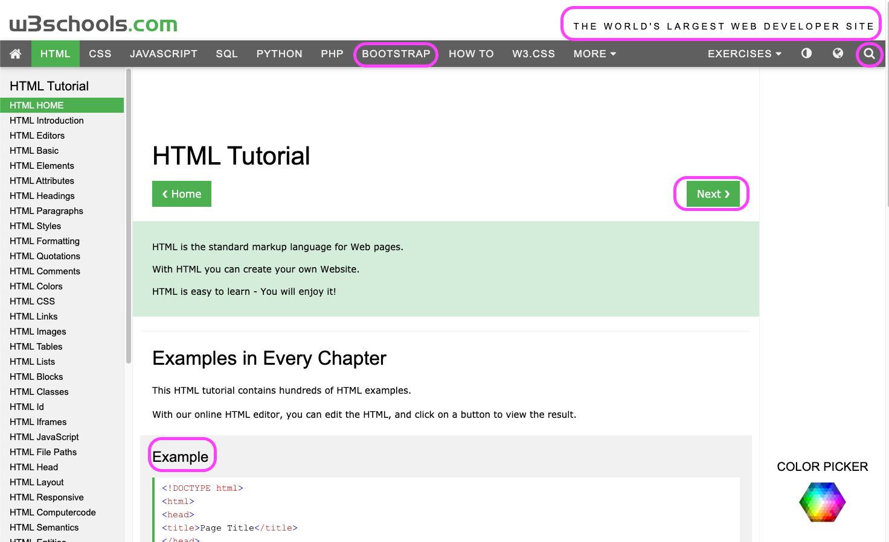

# Selectors

We can use selectors to find element in cypress. Cypress use JQuery to select elements which is also very similar to how we select elements in CSS.

## Select by classname

Using get, we can select elements using class, attibutes, or by tags

```javascript
it("select logo", () => {
  cy.get(".w3schools-logo");
});
```

## Select by Attribute

```js
it("Select by Attribute", () => {
  cy.get('[href = "/html/default.asp"]');
});
```

## Select by id

```js
it("Select by id", () => {
  cy.get("#topnavbtn_exercises");
});
```

## finding item by text

We can use contains to find by text

```js
it("find by text", () => {
  cy.contains("HTML Tutorial");
});
```

## you can also chain cypress commands

We can chain selectors to find text within certain container

```js
it("chaining selectors", () => {
  cy.get(".topnav").contains("CSS");
});
```

## you can use a combination of selectors

`get` can return multiple elements, using `first()` we can get the first element. To get nth element, we can use `eq(0)` or `eq(n)`.

```js
it("combinations of button and class", () => {
  cy.get("a.w3-btn").first();
});
```

## Lab

1. clone repo `git clone https://github.com/thoughtworks-jumpstart/cypress-selector.git`
2. Select the elements circled


