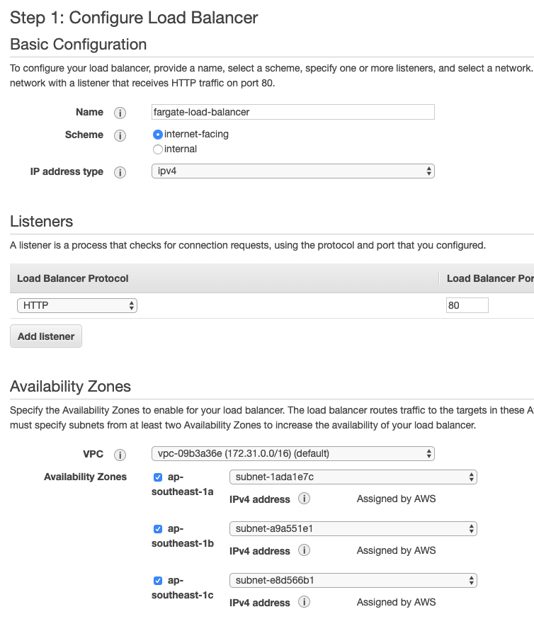
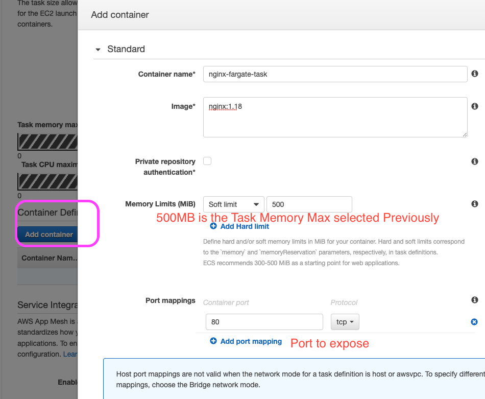
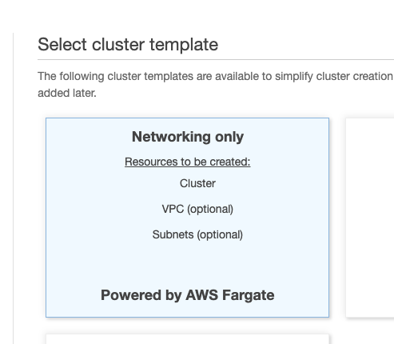
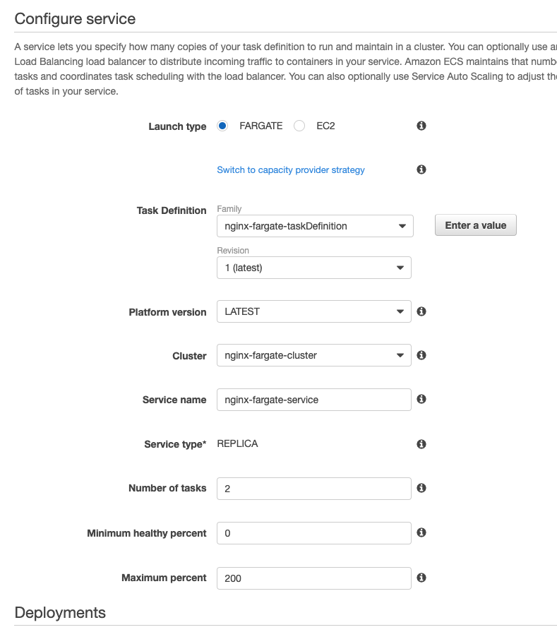
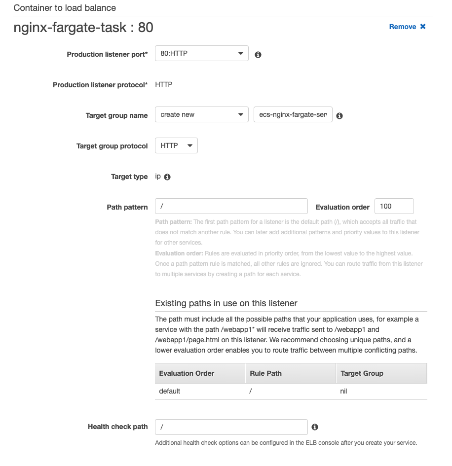
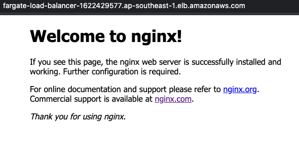

# Fargate

Fargate is a server-less container hosting service by AWS. It allows you to host Docker task without messing with all the EC2 stuff.

- serverless
- less complicated setup
- don't have to maintain EC2 instance

## Create a new Load Balancer for Fargate

Similar to ECS, we can create a load balancer

## Create Task Definition

- Select Fargate
- Add Task Size
- Add Container
- Click Create all the way at bottom

## Create Cluster

- enter name
- click create

## Create Service

- Launch type: Fargate
- Task Definition: `<task-definition>`

- select default VPC
- add all subnets
- Create or change Security group
- add load balancer, created in first step
- disable service discovery
- optional ASG (can skip to have fix instance and set min-max task and target value to scale out.)
- Create Service

## Accessing Fargate

Go to ELB and search for the Public DNS, you should be able to access Nginx

