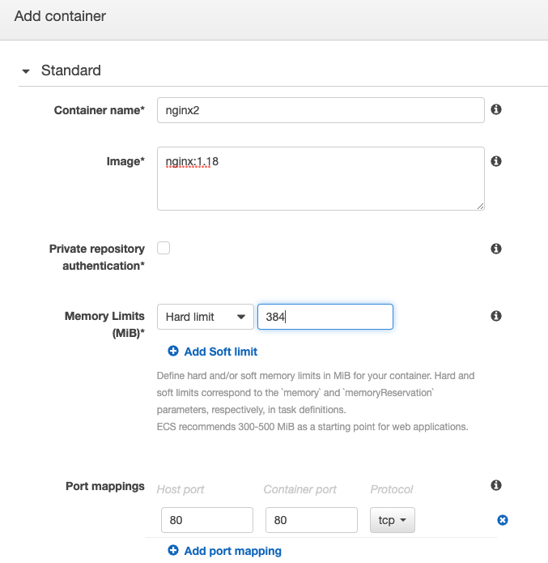

# AWS ECS

Amazon Elastic Container Service (Amazon ECS) is a fully managed container orchestration service.

## Terminology

### Cluster

An Amazon ECS cluster is a regional grouping of one or more container instances on which you can run task requests. Each account receives a default cluster the first time you use the Amazon ECS service. Clusters may contain more than one Amazon EC2 instance type. - [AWS](https://docs.aws.amazon.com/AmazonECS/latest/developerguide/clusters.html)

### Task

Task definitions specify the container information for your application, such as how many containers are part of your task, what resources they will use, how they are linked together, and which host ports they will use. - [AWS](https://docs.aws.amazon.com/AmazonECS/latest/developerguide/task_definitions.html)

Think of it as a Docker container

### Service

A service lets you specify how many copies of your task definition to run and maintain in a cluster. You can optionally use an Elastic Load Balancing load balancer to distribute incoming traffic to containers in your service. - AWS

Configuration of behavior of the Docker containers.

### ECS instance

Machines running the docker containers. One ECS instance can run one or more docker container.

## Creating a Cluster

We have 3 options of creating a cluster

- Fargate: A serverless compute engine for containers
- Auto Scaling group with Linux AMI
- Auto scaling group with Windows AMI

Enter:

- Cluster name: <any name>
- EC2 instance type: `t2.micro` (a larger instance for production)
- Number of instances: 1 (How many EC2 instance)
- EC2 Ami id: `Amazon Linux 2 AMI`
- EBS Storage: 22
- Keypair: Add SSH keypair
- VPC: default vpc
- Container instance IAM role: `Create new role` or `ecsInstanceRole`

After creating a cluster, you will can view the overview.
Currently

- 0 services
- 0 tasks
- 1 EC2 instance

we have 1 instance as this is what we selected before.

## Create Task definition

A task definition specifies which containers are included in your task and how they interact with each other. - [aws](http://docs.aws.amazon.com/AmazonECS/latest/developerguide/task_defintions.html)

### Going to Task definition page

- Under Amazon ECS > Task Definitions
- Click `Create new Task Definition`

### Filling up Task definition

- Task Definition Name: <any name>
- Select EC2
- Task Role: None (Select a IAM role to give permission to access other services like DB or S3)
- Network mode: Default(Configure correctly with Windows or Mac)
- Add Task Memry and Task CPU, below, we selected 384. The number of unit depends on the instance type. A `t2.micro` comes with

### Add container

This is the place where you define what definition to run

## Configure service

Next, we need to create services, which will provide the instuctions to spin up the necessary containers.

Click on Create

- Select EC2 instance
- Select task from the `task definition` that we just created
- Select Cluster to add the service
- Service Type: choose `Replica` - Replica: allow multiple of same container - DAEMON: will only allow 1
- Number of tasks: 2, Depends on instance type and cpu and memory specified for task, sum of all cpu consumtion should be less than instance cpu unit, sum of all memory should be less than instance memory
  

  - We can skip load balancing for now, since we haven't configure a load balancer
  - set auto scaling to none

A task is created for us

Go to public DNS and you should see the nginx welcome page.
If you don't see it, is likely security group issue on EC2 or task definition not set properly.

## Creating multiple ECS behind load balancer

### Create load balancer

1. Create a Application load balancer in all AZ
2. Create Security Group from port 80
3. add a random target group name
4. In security group of ec2 instances for ecs.

- Set traffic to HTTP
- Port Range: `All`
- Set `Source` to be the ALB security group arn

### Scaling Up EC2 instances

Under Cluster > ECS Instances > `Auto Scaling`

### Update Task Definition

- Select Task Definition
- Create new revision
- Under Container Definition
  - Click on Container Name
  - Set port mapping to 0 for dynamic port mapping
- Create task

### Adding capacity per instance

Under Cluster > Service > Create

- Select V2 of task definition and click Next
- Select Application Load Balancer
- Use IAM role
- configure the ELB as below
  - select ALB
  - choose Service IAM
  - Select the newly created Load balancer
  - select port 80
  - update path pattern to root path(where nginx have a valid response)
  - Set Evaluation order

