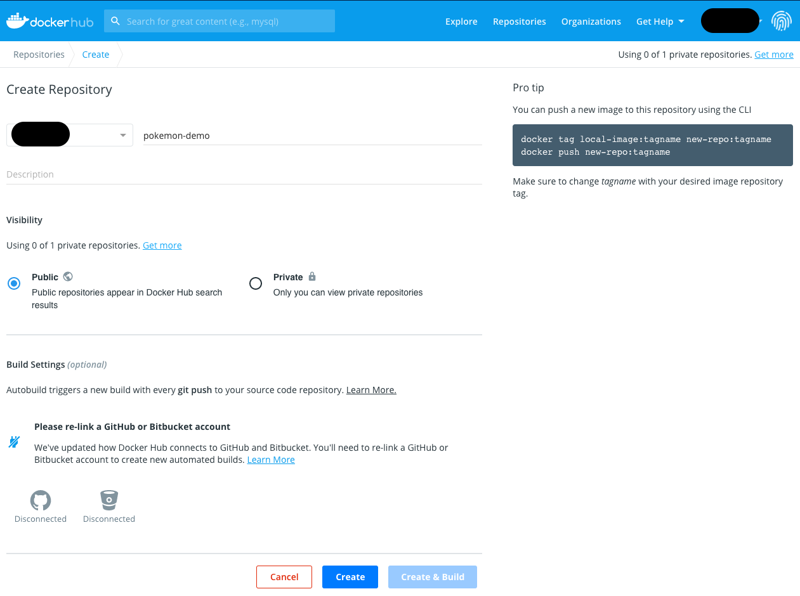
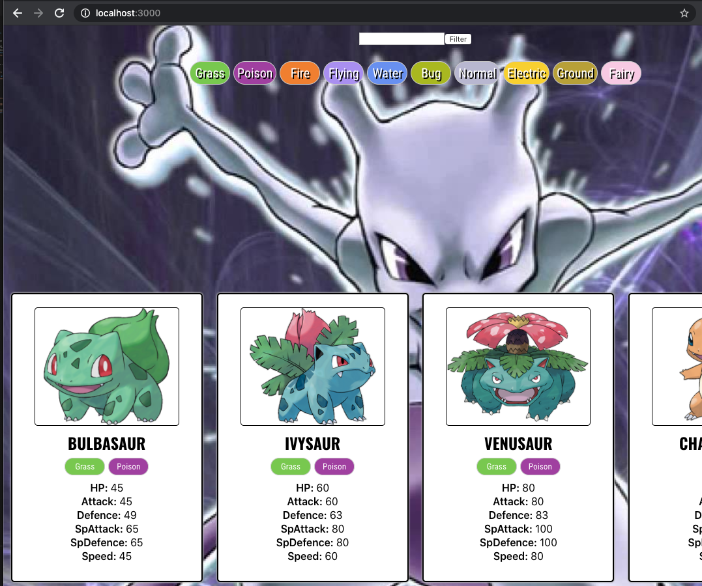
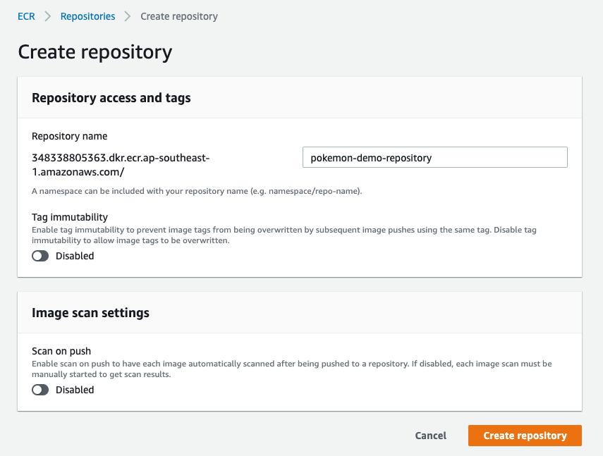
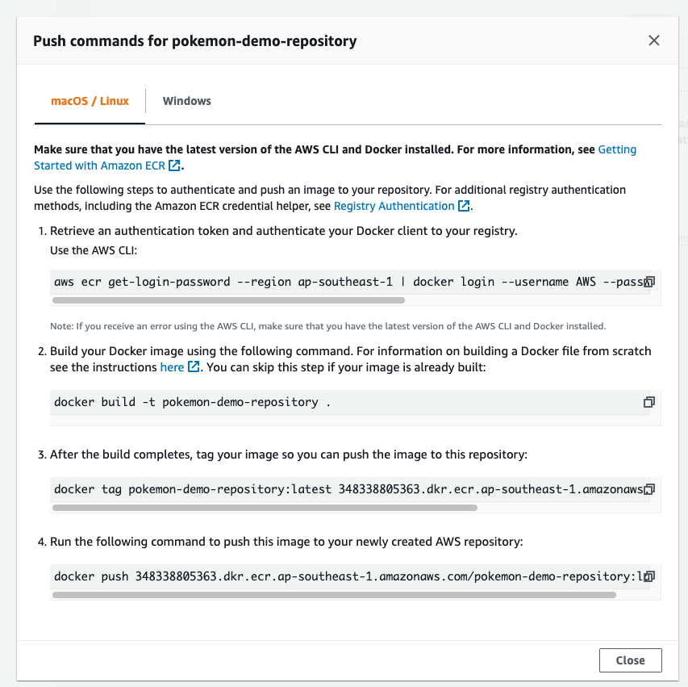
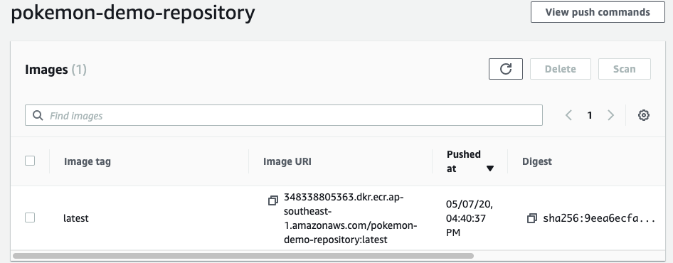
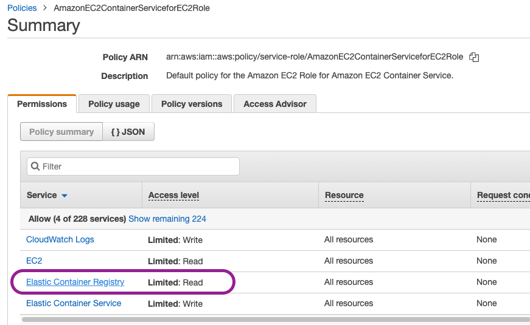

# Docker repository

## Prerequiste

- make sure you have docker install `docker --version`

### Create Dockerfile

create a file `Dockerfile`

```Dockerfile
FROM node:12

WORKDIR /app

COPY package*.json ./

RUN npm install

COPY . ./

CMD ["npm", "start"]
```

### Create Docker ignore file

create a file `.dockerginore`

```.dockerignore
node_modules

build

coverage

.dockerignore
Dockerfile
```

### Build and Tag

`docker build -t elsonlim/pokemon-demo .`

## DockerHub

### Create Repo

1. Create an account in [Dockerhub](https://hub.docker.com/)
2. Create Repo on docker hub



### Push to repo

1. Login with `docker login`
2. Push image `docker push <username>/pokemon-demo:latest`

### To test

1. Remove image locally `docker rmi <username>/pokemon-demo`
2. Pull image `docker pull <username>/pokemon-demo:latest`
3. Run image `docker run -p 3000:3000 -d username>/pokemon-demo`



## AWS Elastic Container Registry

Amazon Elastic Container Registry (ECR) is a fully-managed Docker container registry that makes it easy for developers to store, manage, and deploy Docker container images. Amazon ECR is integrated with Amazon Elastic Container Service (ECS), simplifying your development to production workflow. Amazon ECR eliminates the need to operate your own container repositories or worry about scaling the underlying infrastructure. Amazon ECR hosts your images in a highly available and scalable architecture, allowing you to reliably deploy containers for your applications. Integration with AWS Identity and Access Management (IAM) provides resource-level control of each repository. With Amazon ECR, there are no upfront fees or commitments. You pay only for the amount of data you store in your repositories and data transferred to the Internet. - [AWS](https://aws.amazon.com/ecr/)

**You will need to have AWS Cli setup, with the correct IAM permission to use ECR.**

### The key reason I think you will want to use ECR over DockerHub

From the docs:

- `You can configure policies to manage permissions and control access to your images using AWS Identity and Access Management (IAM) users and roles`
- `without having to manage credentials directly on your EC2 instances`

- You don't have to give special permission using EKS to talk to pull from ECR
  - IAM can control the permission to access ECR, perfect if you are already using other AWS services and IAM to configure everything.

### Reason you might not want to use ECR

- It will be harder to use the images outside of AWS.
- You are tight down to more AWS services making moving to other platforms(GCP, Azure) harder.
- Another thing to learn developers might make onboarding harder and development time longer.

### Create Repository



### Push to repository

- Click into the repo
- Click on view push commands and follow the instructions



The instruction will

1. Login to AWS
2. Build the image
3. Tag the build image to link to ECR
4. Push the image to ECR



### Pull the image

`docker pull <image URI>`

### Using private image in ECS

- To use in ECS, just change the `Task Definition` to use the ECR `<image URI>`
- If fail you will need to set the IAM permission. [Read More](https://docs.aws.amazon.com/AmazonECR/latest/userguide/repository-policies.html)


