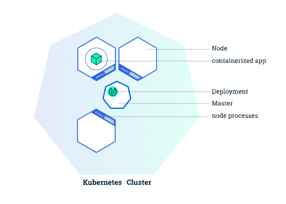

# About Kubernetes

[Kubernetes(k8s)](https://kubernetes.io/) is a container orchestration tool. The idea behind container orchestration comes with the term Desried State configuration(DSC). In simple, we can specific what is the desired state of a distribute computing. What are the machines we have(nodes), how many and what are the docker containers we want to run and k8s will manage the instance for us.

K8S are often mention together with Microservices Architecture. They are not requried to be used together. Building Microservices leads to creations of lots of servers and maintaining them is a real challenge. Docker makes starting up services easy by having all the dependencies self contain and we can use K8s to mangae the amount of docker instances that are running, deploying new versions of the image easy.

[Read more](https://kubernetes.io/docs/tutorials/kubernetes-basics/deploy-app/deploy-intro/)

## Some Alternatives

### Self hosted

1. [Docker Swarm](https://docs.docker.com/get-started/swarm-deploy/)
2. [Apache Mesos](https://mesos.apache.org/)
3. [Nomad](https://www.nomadproject.io/)

### Managed Kubernetes service

Also known as Kubernetes as a service.
Arguable inbetween a PAAS and a IAAS

1. [Google Kubernetes Enginer (GKE)](https://cloud.google.com/kubernetes-engine)
2. [Azure Kubernetes Service (AKS)](https://docs.microsoft.com/en-us/azure/aks/)
3. [Amazon Elastic Kubernetes Service (EKS)](https://aws.amazon.com/eks/)
4. [DigitalOcean Kubernetes (DOKS)](https://www.digitalocean.com/products/kubernetes/)

## Components that made up K8s

https://kubernetes.io/docs/concepts/overview/components/
