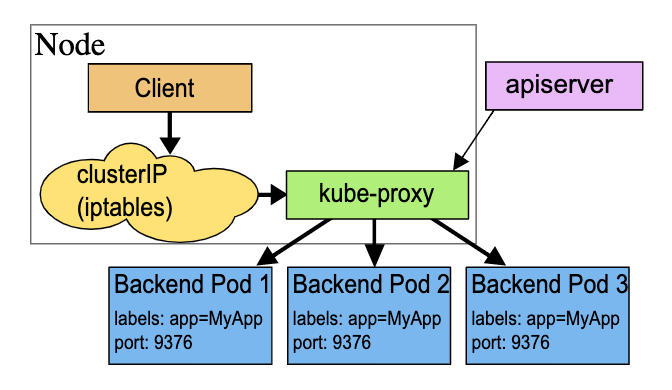
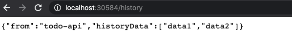

# ClusterIP

ClusterIP Service allow a easy way for pods to talk with each other.
A internal Node look for a translation in the iptables and translate to a internal IP address to reach a internal service.



## Setting up a new api

```js
const express = require("express");
const app = express();
const port = 5000;

app.get("/", (req, res) => res.json(["data1", "data2"]));

app.listen(port, () =>
  console.log(`Example app listening at http://localhost:${port}`)
);
```

## Creating a new deployment

Create a new file `todo-history-deployment.yaml`

```yaml
apiVersion: apps/v1
kind: Deployment
metadata:
  name: todo-history-deployment
  labels:
    app: todo-history
spec:
  replicas: 1
  selector:
    matchLabels:
      app: todo-history
  template:
    metadata:
      labels:
        app: todo-history
    spec:
      containers:
        - name: todo-history
          image: xxx/todo-history-api
          ports:
            - containerPort: 5000
```

## push history api to dockerhub

```bash
docker build -t xxx/todo-history-api .
docker push
```

### Create a Cluster IP

Create a new file `todo-history-service.yaml`

```yaml
apiVersion: v1
kind: Service
metadata:
  name: todo-history-clusterip-srv
spec:
  type: ClusterIP
  selector:
    app: todo-history
  ports:
    - name: todo-history
      protocol: TCP
      port: 5000
      targetPort: 5000
```

## Update the deployment file for todo

In `todolist-deployment.yaml`

```yaml
apiVersion: apps/v1
kind: Deployment
metadata:
  name: todo-list-deployment
  labels:
    app: todo-list
spec:
  replicas: 3
  selector:
    matchLabels:
      app: todo-list
  template:
    metadata:
      labels:
        app: todo-list
    spec:
      containers:
        - name: todo-list
          image: xxx/todo-list-api
          ports:
            - containerPort: 5000
          env:
            - name: HISTORY_API
              value: "http://todo-history-clusterip-srv:5000"
```

## Adding new Route in todo

In `history.route.js`

```js
const express = require("express");
const axios = require("axios");

const router = express.Router();

router.get("/", async (req, res) => {
  const historyData = await axios
    .get(process.env.HISTORY_API)
    .then((res) => res.data);
  res.json({
    from: "todo-api",
    historyData,
  });
});

module.exports = router;
```

## Push update to Docker Hub

```bash
docker build -t xxx/todo-list-api .
docker push
```

## Update Kubernetes Cluster

```bash
kubectl apply -f ./k8s/todolist-service.yaml
kubectl apply -f ./k8s/todohistory-deployment.yaml
kubectl rollout restart deployment todo-list-deployment
```

## Visit the NodePort



## ClusterIP Service Lab

1. Create a MongoDB deployment
2. Create a ClusterIP for the mongoDB service
3. Connect a express app to the mongodb in the K8s Cluster.
