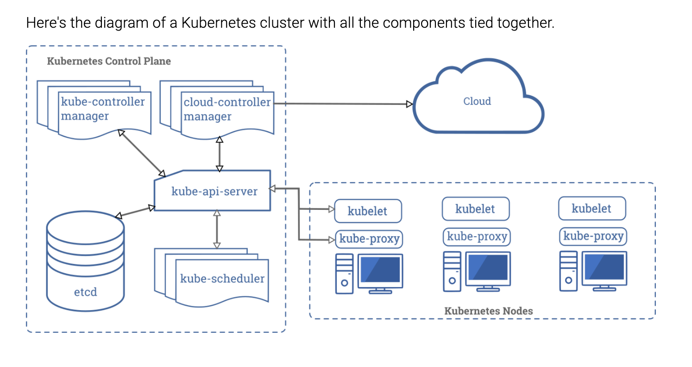

# Deployment

> A Deployment provides declarative updates for Pods and ReplicaSets.

> You describe a desired state in a Deployment, and the Deployment Controller changes the actual state to the desired state at a controlled rate. You can define Deployments to create new ReplicaSets, or to remove existing Deployments and adopt all their resources with new Deployments. - [kubernetes.io](https://kubernetes.io/docs/concepts/workloads/controllers/deployment/)

If we want 3 containers of the same image to run, instead of created the same Pod 3 times, we acn create a deployment and specify how many of the image kubernetes should run for us.

Deployment is very useful for controlling scaling and updates.

## Running a deployment

### Creating a deployment

```bash
❯ kubectl create deployment hello-world-deploy --image=hello-world
deployment.apps/hello-world-deploy created
```

### Viewing created Objects

Below, we can see 3 objects created for us.
A deploymnet, a replica set and a pod. When we run `kubectl create deployment hello-world-deploy --image=hello-world`, kubernetes will create a deployment, replicaset and a pod.

The deplooyment object contains all meta data regards what images to run and how many sets. Using the the data, a replicaset will be created that specify how many of this speicfic image needs to be created. Then Kubernetes will create the set according.

```bash
❯ kubectl get all
NAME                                      READY   STATUS      RESTARTS   AGE
pod/hello-world-deploy-5fbbbc75cb-s9tr7   0/1     Completed   0          7s

NAME                 TYPE        CLUSTER-IP   EXTERNAL-IP   PORT(S)   AGE
service/kubernetes   ClusterIP   10.96.0.1    <none>        443/TCP   23s

NAME                                 READY   UP-TO-DATE   AVAILABLE   AGE
deployment.apps/hello-world-deploy   0/1     1            0           7s

NAME                                            DESIRED   CURRENT   READY   AGE
replicaset.apps/hello-world-deploy-5fbbbc75cb   1         1         0       7s
```

### Workflow of deployment



1. api-server receive the cmd `kubectl create deployment`
2. api-server create a record of `deployment.apps/hello-world-deploy` in `etcd`.
3. `kube-controller` checks for change in deployment objects in etcd, found `deployment.apps/hello-world-deploy` and creates `replicaset.apps/hello-world-deploy-54c8f9cf7f` and `pod/hello-world-deploy-54c8f9cf7f-gdfzd`
4. `kube-scheduler` then sees pods that are pending that look at the available Nodes that it can best assign to.
5. Respective Kublet talks to `api-server` to check for things to do, `api-server` then tell `kublet` about new pods that needs to be created.
6. Kublet then create the Pods and set the status in `etcd` of the pod to `Running`

### Scaling deploymnet

One reason to use k8s is for scaling container. we can specify how many container we want to scale using `kubectl scale --replicas=4 <deployment-object>`. This changes the

```bash
❯ kubectl create deployment my-dep --image=xxx/todo-list-api
❯ kubectl scale --replicas=4 deployment.apps/my-dep
❯ kubectl get all
NAME                          READY   STATUS        RESTARTS   AGE
pod/my-dep-644b5f6489-4qc9z   1/1     Running       0          17s
pod/my-dep-644b5f6489-7gjml   1/1     Running       0          17s
pod/my-dep-644b5f6489-bsrlk   1/1     Running       0          35s
pod/my-dep-644b5f6489-fqnf2   1/1     Running       0          17s
pod/my-dep-644b5f6489-r8vj8   1/1     Terminating   0          44s

NAME                 TYPE        CLUSTER-IP   EXTERNAL-IP   PORT(S)   AGE
service/kubernetes   ClusterIP   10.96.0.1    <none>        443/TCP   37s

NAME                     READY   UP-TO-DATE   AVAILABLE   AGE
deployment.apps/my-dep   4/4     4            4           35s

NAME                                DESIRED   CURRENT   READY   AGE
replicaset.apps/my-dep-644b5f6489   4         4         4       35s
```

### Deployment template

Create a `k8s/todolist-deployment.yaml` file

```yaml
apiVersion: apps/v1
kind: Deployment
metadata:
  name: todo-list-deployment
  labels:
    app: todo-list
spec:
  replicas: 3
  selector:
    matchLabels:
      app: todo-list
  template:
    metadata:
      labels:
        app: todo-list
    spec:
      containers:
        - name: todo-list
          image: xxx/todo-list-api
          ports:
            - containerPort: 5000
```

**Do not change this label.**

```bash
kubectl apply -f k8s/todolist-deployment.yaml
```

Update Api

```js
app.get("/", (req, res) => res.send("Hello World! 2"));
```

Push to dockerhub

```
docker push xxx/todo-list-api
```

### Roll Out change

```bash
kubectl rollout restart deployment todo-list-deployment
```

a new deploymnet is made and all changes are now at `7c49dfb884`

```bash
❯ kubectl get all
NAME                                        READY   STATUS    RESTARTS   AGE
pod/todo-list-deployment-7c49dfb884-6mz5s   1/1     Running   0          58s
pod/todo-list-deployment-7c49dfb884-ss569   1/1     Running   0          52s
pod/todo-list-deployment-7c49dfb884-xbz7k   1/1     Running   0          63s

NAME                 TYPE        CLUSTER-IP   EXTERNAL-IP   PORT(S)   AGE
service/kubernetes   ClusterIP   10.96.0.1    <none>        443/TCP   46m

NAME                                   READY   UP-TO-DATE   AVAILABLE   AGE
deployment.apps/todo-list-deployment   3/3     3            3           42m

NAME                                              DESIRED   CURRENT   READY   AGE
replicaset.apps/todo-list-deployment-788f65d46f   0         0         0       42m
replicaset.apps/todo-list-deployment-7c49dfb884   3         3         3       63s
```

### Describe deployment

Looking at logs

- Observe the rollout deployment

```bash
❯ kubectl describe deployment -l app=todo-list
Name:                   todo-list-deployment
Namespace:              default
CreationTimestamp:      Mon, 15 Jun 2020 22:48:28 +0800
Labels:                 app=todo-list
Annotations:            deployment.kubernetes.io/revision: 2
                        kubectl.kubernetes.io/last-applied-configuration:
                          {"apiVersion":"apps/v1","kind":"Deployment","metadata":{"annotations":{},"labels":{"app":"todo-list"},"name":"todo-list-deployment","names...
Selector:               app=todo-list
Replicas:               3 desired | 3 updated | 3 total | 3 available | 0 unavailable
StrategyType:           RollingUpdate
MinReadySeconds:        0
RollingUpdateStrategy:  25% max unavailable, 25% max surge
Pod Template:
  Labels:       app=todo-list
  Annotations:  kubectl.kubernetes.io/restartedAt: 2020-06-15T23:30:10+08:00
  Containers:
   todo-list:
    Image:        xxx/todo-list-api
    Port:         5000/TCP
    Host Port:    0/TCP
    Environment:  <none>
    Mounts:       <none>
  Volumes:        <none>
Conditions:
  Type           Status  Reason
  ----           ------  ------
  Available      True    MinimumReplicasAvailable
  Progressing    True    NewReplicaSetAvailable
OldReplicaSets:  <none>
NewReplicaSet:   todo-list-deployment-7c49dfb884 (3/3 replicas created)
Events:
  Type    Reason             Age    From                   Message
  ----    ------             ----   ----                   -------
  Normal  ScalingReplicaSet  46m    deployment-controller  Scaled up replica set todo-list-deployment-788f65d46f to 3
  Normal  ScalingReplicaSet  4m56s  deployment-controller  Scaled up replica set todo-list-deployment-7c49dfb884 to 1
  Normal  ScalingReplicaSet  4m52s  deployment-controller  Scaled down replica set todo-list-deployment-788f65d46f to 2
  Normal  ScalingReplicaSet  4m51s  deployment-controller  Scaled up replica set todo-list-deployment-7c49dfb884 to 2
  Normal  ScalingReplicaSet  4m45s  deployment-controller  Scaled down replica set todo-list-deployment-788f65d46f to 1
  Normal  ScalingReplicaSet  4m45s  deployment-controller  Scaled up replica set todo-list-deployment-7c49dfb884 to 3
  Normal  ScalingReplicaSet  4m37s  deployment-controller  Scaled down replica set todo-list-deployment-788f65d46f to 0
```

### Rolling back a version

```bash
❯ kubectl rollout undo deployment.apps/todo-list-deployment
deployment.apps/todo-list-deployment rolled back
```

### Scaling

```bash
❯ kubectl scale deployment.apps/todo-list-deployment --replicas=10
deployment.apps/todo-list-deployment scaled
```

```bash
❯ kubectl get pods
NAME                                    READY   STATUS              RESTARTS   AGE
todo-list-deployment-788f65d46f-5md2g   1/1     Running             0          77s
todo-list-deployment-788f65d46f-6vbfv   1/1     Running             0          71s
todo-list-deployment-788f65d46f-9lxv2   0/1     ContainerCreating   0          26s
todo-list-deployment-788f65d46f-bn7xb   1/1     Running             0          26s
todo-list-deployment-788f65d46f-bq6xg   1/1     Running             0          26s
todo-list-deployment-788f65d46f-c9qvn   1/1     Running             0          26s
todo-list-deployment-788f65d46f-g4tqt   0/1     ContainerCreating   0          26s
todo-list-deployment-788f65d46f-l48z8   1/1     Running             0          61s
todo-list-deployment-788f65d46f-npzks   0/1     ContainerCreating   0          26s
todo-list-deployment-788f65d46f-vx729   0/1     ContainerCreating   0          26s
```

### Cleanup

```bash
❯ kubectl delete -f ./k8s/todolist-deployment.yaml
deployment.apps "todo-list-deployment" deleted

❯ kubectl get all
NAME                 TYPE        CLUSTER-IP   EXTERNAL-IP   PORT(S)   AGE
service/kubernetes   ClusterIP   10.96.0.1    <none>        443/TCP   57m
```

## Lab

1. Create a deployment on an express app with 1 instance
2. Update the express app and see the change
3. Update the express app to v2
4. Scale to 5 instance
5. clean up the deployment
