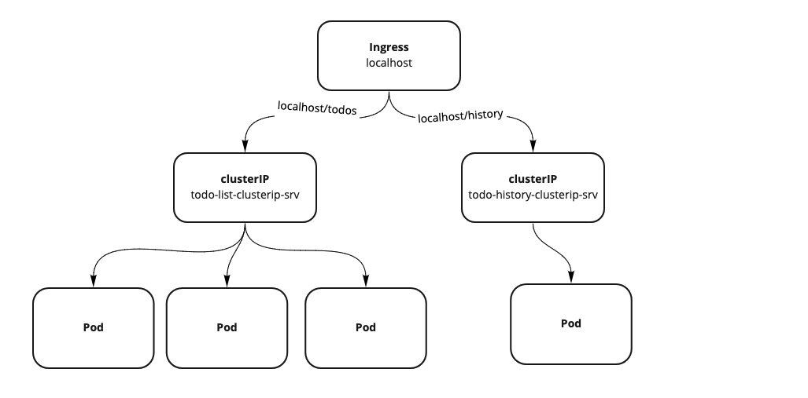

# Ingress

> An API object that manages external access to the services in a cluster, typically HTTP. Ingress may provide load balancing, SSL termination and name-based virtual hosting. - [kubernetes.io](https://kubernetes.io/docs/concepts/services-networking/ingress/)

- Ingress allow http and https traffic to come into the cluster
- K8s doens't have a buildin Ingress Controller Manager, you will need to install one



## Ingress controller

Here, we will use [ingress-nginx](https://kubernetes.github.io/ingress-nginx/deploy/).

For alternative, click [here](https://kubernetes.io/docs/concepts/services-networking/ingress-controllers/)

### For Mac

```bash
kubectl apply -f https://raw.githubusercontent.com/kubernetes/ingress-nginx/master/deploy/static/provider/cloud/deploy.yaml
```

### For microk8s

[Instructions](https://kndrck.co/posts/microk8s_ingress_example/)

```bash
microk8s.kubectl apply -f https://raw.githubusercontent.com/kubernetes/ingress-nginx/master/deploy/static/mandatory.yaml

microk8s.enable ingress
```

### Ingress Service

```yaml
apiVersion: networking.k8s.io/v1beta1
kind: Ingress
metadata:
  name: todos-ingress
  annotations:
    nginx.ingress.kubernetes.io/rewrite-target: /$2
spec:
  rules:
    - http:
        paths:
          - path: /todos(/|$)(.*)
            backend:
              serviceName: todo-list-clusterip-srv
              servicePort: 5000
          - path: /history
            backend:
              serviceName: todo-history-clusterip-srv
              servicePort: 5000
```

**Behavior:**

`http://localhost/todos/todos` => `http://todo-list-clusterip-srv/todos`
`http://localhost/todos/history` => `http://todo-list-clusterip-srv/history`
`http://localhost/history` => `http://todo-history-clusterip-srv`

In the example above, we actually did not have to expose the history api. Is added in as an example to load balance multiple routes.

## Ingress Lab

1. Setup an Ingress and try out the routes
