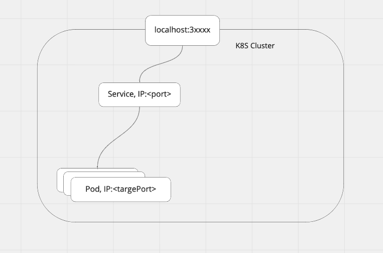

# Service

> An abstract way to expose an application running on a set of Pods as a network service. - [kubernetes.io](https://kubernetes.io/docs/concepts/services-networking/service/)

We will look at 3 type of Service here

1. NodePod
2. LoadBalancer
3. ClusterIp

## NodePod

- Assigning a service to a port for public access.
- connecting service to pods of a deployment
- port range of 30000-32767
- good for development but bad for prod as it breaks when ip address changes

Example of a NodePort Service Yaml

```yaml
apiVersion: v1
kind: Service
metadata:
  name: todolist-service
spec:
  type: NodePort
  selector:
    app: todo-list
  ports:
    - name: todo-list
      protocol: TCP
      port: 5000
      targetPort: 5000
```

The `spec.selector.app` must have the same label from the deployment yaml file

```yaml
metadata:
  labels:
    app: todo-list
```



There are 3 type of ports in nodeport.

- nodePort: Exposes a Service using static port, randomly assigned if not specify(prefered)
- port: The actual port use by the service
- targetPort: port of the node

```bash
❯ kubectl get services
NAME               TYPE        CLUSTER-IP      EXTERNAL-IP   PORT(S)          AGE
kubernetes         ClusterIP   10.96.0.1       <none>        443/TCP          16h
todolist-service   NodePort    10.98.120.223   <none>        5000:30511/TCP   46m
```


## Nodeport Service Lab

1. Create a nodeport service and connect to a deployment
