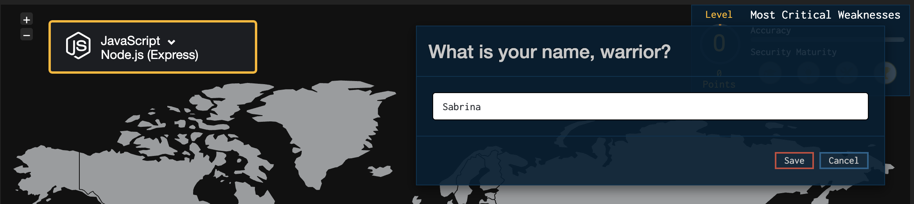

# Injection

Injection flaws, such as SQL, NoSQL, OS, and LDAP (Lightweight Directory Access Protocol) injection, occur when **untrusted data is sent to an interpreter as part of a command or query**. The attacker’s hostile data can trick the interpreter into executing unintended commands or accessing data without proper authorisation.

## Example

To illustrate this, let's play a game.

1. Go to https://securecodewarrior.com/

2. Click on `PLAY NOW` in the navbar:

3. Enter your name and select `JavaScript Node.js (Express)`:

4. Click on `Enter game mode`. You should end up here: https://portal.securecodewarrior.com/#/website-trial/web/injection/sql/nodejs/express/realm/teaser/level/showcase/quest/injection_sql

5. Follow the game instructions! You'll need to locate the vulnerability, and identify the correct solution.

## Prevention
- Provide a **parameterised interface**
- Do not use string-concatenated queries

- Validate user-supplied input. Read more [here](https://cheatsheetseries.owasp.org/cheatsheets/Input_Validation_Cheat_Sheet.html).
- Validate input server-side with a **whitelist** instead of a blacklist. This way, you can define exactly what IS authorised - everything else is not authorised.
- Use source code review tools
- Add automated testing for all parameters, headers, URL, cookies, JSON, SOAP, and XML data inputs

**More resources:**

https://cheatsheetseries.owasp.org/cheatsheets/SQL_Injection_Prevention_Cheat_Sheet.html
https://cheatsheetseries.owasp.org/cheatsheets/LDAP_Injection_Prevention_Cheat_Sheet.html
