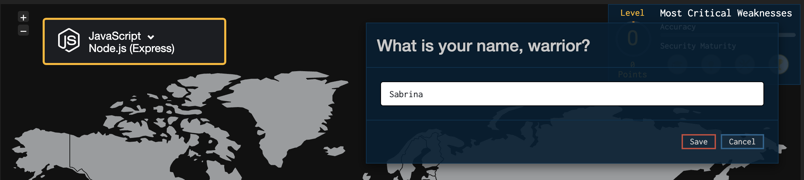
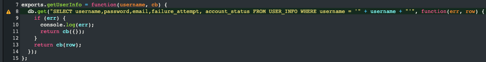
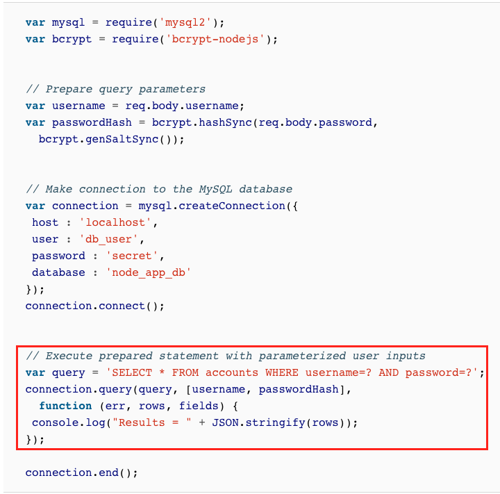
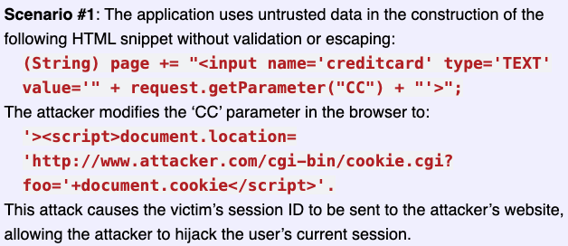

# OWASP Top 10

The OWASP Top 10 is one of many projects by OWASP. It is a standard awareness document for developers and web application security.

It represents a broad consensus about **the most critical security risks to web applications**, i.e. top 10 most frequently used exploits in a website or application.

The OWASP Top 10 document is globally recognised by developers as the **most effective first step towards changing the software development culture within your organisation** into one that produces more secure code. Companies should adopt this document and start the process of ensuring that their web applications minimise these risks.

Read more here: https://owasp.org/www-project-top-ten/

# 1. Injection


Injection flaws, such as SQL, NoSQL, OS, and LDAP (Lightweight Directory Access Protocol) injection, occur when **untrusted data is sent to an interpreter as part of a command or query**. The attacker’s hostile data can trick the interpreter into executing unintended commands or accessing data without proper authorisation.

## Activity

To illustrate this, let's play a game.

1. Go to https://securecodewarrior.com/

2. Click on `PLAY NOW` in the navbar:


3. Enter your name and select `JavaScript Node.js (Express)`:



4. Click on `Enter game mode`. You should end up here: https://portal.securecodewarrior.com/#/website-trial/web/injection/sql/nodejs/express/realm/teaser/level/showcase/quest/injection_sql

5. Follow the game instructions! You'll need to locate the vulnerability, and identify the correct solution.

## Prevention
- Do not use string-concatenated queries:



- Provide a **parameterised interface**:


- Validate all user-supplied input
- Validate input server-side with a **whitelist** instead of a blacklist. This way, you can define exactly what IS authorised - everything else is not authorised.
- Use source code review tools, e.g. [Detectify](https://detectify.com/product/deep-scan). There are also many other tools (both open-source and commercial) available; [this](https://owasp.org/www-community/Source_Code_Analysis_Tools) is a good list to reference.
- Add automated testing for all parameters, headers, URL, cookies, JSON, SOAP, and XML data inputs

**More resources:**

- https://cheatsheetseries.owasp.org/cheatsheets/SQL_Injection_Prevention_Cheat_Sheet.html
- https://cheatsheetseries.owasp.org/cheatsheets/Input_Validation_Cheat_Sheet.html
- https://www.oreilly.com/library/view/securing-node-applications/9781491982426/ch01.html

# 2. Broken Authentication

Application functions related to authentication and session management are often implemented incorrectly, allowing attackers to compromise passwords, keys, or session tokens, or to exploit other implementation flaws to assume other users’ identities temporarily or permanently.

## Examples

1. [Brute-force attack](https://en.wikipedia.org/wiki/Brute-force_attack): the attacker submits many passwords with the hope of eventually guessing correctly [[1]](https://www.youtube.com/watch?v=88PvZM4wJsY)
1. [Credential stuffing](https://owasp.org/www-community/attacks/Credential_stuffing): the attacker uses a list of **breached username/password pairs** and gains access to user accounts
1. [Session](https://auth0.com/docs/sessions/concepts/session-lifetime) timeout is not appropriately set up

## Prevention

- Implement [rate limits](https://auth0.com/docs/connections/database/rate-limits) - if a user enters their password incorrectly more than X times consecutively from a single IP address, they will be blocked from logging into their account from that IP address
- Implement Two-factor Authentication (2FA), e.g. Google Authenticator with a [TOTP (Time-based One-Time Password)](https://tools.ietf.org/html/rfc6238) generator like [otplib](https://github.com/yeojz/otplib) or [Speakeasy](https://github.com/speakeasyjs/speakeasy)
- Implement Multi-factor Authentication (MFA) e.g. with [Okta](https://www.okta.com/products/adaptive-multi-factor-authentication/)
- Implement CAPTCHA (Completely Automated Public Turing test to tell Computers and Humans Apart) or reCAPTCHA [v2](https://developers.google.com/recaptcha/docs/versions#recaptcha_v2_im_not_a_robot_checkbox) / [v3](https://www.google.com/recaptcha/intro/v3.html)
- Require reauthentication after every X hours, depending on the sensitivity of the data
- For high-risk data (e.g. financial information), set sessions to **time out after 2-5 minutes of idle time**. It can be set to 15-30 minutes for low-risk applications. e.g. with [express-session](https://www.npmjs.com/package/express-session#cookiemaxage-1) and setting `maxAge`/`expires` value:

```
var hour = 3600000
req.session.cookie.expires = new Date(Date.now() + hour)
req.session.cookie.maxAge = hour
```
- Implement weak-password checks (e.g. minimum length, special characters/numbers required). On the front-end, you can guide the user with a password strength meter using a package like [react-password-strength](https://github.com/mmw/react-password-strength) [see [demo](https://reactpasswordstrength.netlify.app/)]
- Allow pasting into password fields (so that users can use a password manager like [LastPass](https://www.lastpass.com/), [1Password](https://1password.com/), or [KeePass](https://keepass.info/). These tools help generate secure passwords and stores them in a password vault.)

## Activity

1. Check if your email address has previously been exposed in data breaches [here](https://haveibeenpwned.com/).
1. Check if your password has previously been exposed in data breaches [here](https://haveibeenpwned.com/Passwords).
1. Install `Authy` on your desktop/phone, or `Google Authenticator` on your phone. [Follow these steps](https://help.github.com/en/github/authenticating-to-github/configuring-two-factor-authentication) to set up 2FA on your Github account.

**More resources:**

- Weak passwords: https://github.com/danielmiessler/SecLists/tree/master/Passwords
- https://cheatsheetseries.owasp.org/cheatsheets/Credential_Stuffing_Prevention_Cheat_Sheet.html
- https://github.com/danielmiessler/SecLists
- https://auth0.com/blog/when-ux-equals-keeping-or-losing-the-customer/

# 3. Sensitive Data Exposure

Many web applications and APIs do not properly protect sensitive data, such as financial, healthcare, and Personally Identifiable Information (PII). Attackers may steal or modify such weakly protected data to conduct credit card fraud, identity theft, or other crimes. Sensitive data may be compromised without extra protection, such as encryption at rest or in transit, and requires special precautions when exchanged with the browser.

## Examples

1. Passwords stored in plain text. A hacker gains access to the database and the username/password pairs. The hacker is able to use the passwords to log in to the affected user accounts.
2. Passwords stored are hashed with a simple algorithm, and is not salted. A hacker gains access to the database and the username/hashed password pairs, and is able to [reverse the hash](https://md5hashing.net/) to obtain the original password. The hacker is able to use the passwords to log in to the affected user accounts. 

## Activity

Let's explore some more examples with some interactive exercises.

1. [Token exposure in URL](https://application.security/free-application-security-training/owasp-top-10-token-exposure-in-url)
1. [PII data in URL](https://application.security/free-application-security-training/owasp-top-10-personally-identifiable-data-in-url)

Both of these instances can cause sensitive information to be exposed to third-party systems.

## Prevention

- **Always salt and hash passwords** (this is like adding extra data to the password and then scrambling it in a way that can't be reversed), e.g. with [bcrypt](https://www.npmjs.com/package/bcryptjs). This way, even if attackers gain access to the hashed passwords, they would not be able retrieve the original password, and would therefore be unable to log in to the affected user accounts. [Read more on why hashing **with a salt** is important.](https://auth0.com/blog/adding-salt-to-hashing-a-better-way-to-store-passwords/)
- Do **not** transmit sensitive data through URL query parameters, e.g. `website.com/resource?auth_token=q3hd8nd8s` or `website.com/register?email=user@email.com`
- Use [HTTP headers](https://developer.mozilla.org/en-US/docs/Web/HTTP/Headers) for transmitting sensitive data like session tokens
- Configure web forms submitting PII data to use the `POST` method
- Get SSL certificate from [Let's Encrypt](https://letsencrypt.org/), to enable secure connections with HTTPS. This means that all communications between your browser and the website are encrypted.
- Force SSL: force some or all pages to be visited over SSL, e.g. with [express-force-ssl](https://github.com/battlejj/express-force-ssl)

**More resources:**

- https://www.howtogeek.com/434930/why-are-companies-still-storing-passwords-in-plain-text/
- https://www.izooto.com/blog/understanding-http-https-protocols

# 4. XML External Entities (XXE)

XXE is a type of attack against an application that parses XML input. It occurs when untrusted XML input containing a reference to an external entity is processed by a weakly/poorly configured XML parser. 
This can lead to disclosure of confidential data, internal port scanning, [Server Side Request Forgery (SSRF)](https://owasp.org/www-community/attacks/Server_Side_Request_Forgery), remote code execution, and [denial of service](https://owasp.org/www-community/attacks/Denial_of_Service) (DoS) attacks. 

## Examples

1. **Denial of Service** attack: XML Bomb, e.g. [Billion laughs attack](https://en.wikipedia.org/wiki/Billion_laughs_attack). It works by flooding the XML parser with a large document, which causes the application to consume all of its available memory until the process crashes: 
``` xml
<?xml version="1.0" encoding="utf-8"?>
<!DOCTYPE lolz [
<!ENTITY lol "lol">
<!ENTITY lol1 "&lol;&lol;&lol;&lol;&lol;&lol;&lol;&lol;&lol;&lol;">
<!ENTITY lol2 "&lol1;&lol1;&lol1;&lol1;&lol1;&lol1;&lol1;&lol1;&lol1;&lol1;">
<!ENTITY lol3 "&lol2;&lol2;&lol2;&lol2;&lol2;&lol2;&lol2;&lol2;&lol2;&lol2;">
<!ENTITY lol4 "&lol3;&lol3;&lol3;&lol3;&lol3;&lol3;&lol3;&lol3;&lol3;&lol3;">
<!ENTITY lol5 "&lol4;&lol4;&lol4;&lol4;&lol4;&lol4;&lol4;&lol4;&lol4;&lol4;">
<!ENTITY lol6 "&lol5;&lol5;&lol5;&lol5;&lol5;&lol5;&lol5;&lol5;&lol5;&lol5;">
<!ENTITY lol7 "&lol6;&lol6;&lol6;&lol6;&lol6;&lol6;&lol6;&lol6;&lol6;&lol6;">
<!ENTITY lol8 "&lol7;&lol7;&lol7;&lol7;&lol7;&lol7;&lol7;&lol7;&lol7;&lol7;">
<!ENTITY lol9 "&lol8;&lol8;&lol8;&lol8;&lol8;&lol8;&lol8;&lol8;&lol8;&lol8;">
]>
<lolz>&lol9;</lolz>
```
2. **Disclosure of confidential data** from the server:
``` xml
<?xml version="1.0" encoding="ISO-8859-1"?>
<!DOCTYPE foo [
<!ELEMENT foo ANY >
<!ENTITY xxe SYSTEM "file:///etc/passwd" >]>
<foo>&xxe;</foo>
```
3. **Server Side Request Forgery** attack:
```
<?xml version="1.0" encoding="utf-8"?>
<!DOCTYPE updateProfile [
<!ENTITY ssrf SYSTEM 'http://10.0.0.2/users.php?delete=all'> ]>
<updateProfile>
<firstname>Joe</firstname>
<lastname>&ssrf;</lastname>
</updateProfile>
```

## Activity

Here is an interactive exercise to illustrate an example of an XXE attack:

[XML Entity injection](https://application.security/free-application-security-training/owasp-top-10-xml-entity-injection)

## Prevention

- Configure application’s XML parsers to **disable the parsing of XML eXternal Entities (XXE) and Document Type Definitions (DTD)** when parsing XML documents. If DTDs cannot be completely disabled, developers must disable the parsing of external general entities and external parameter entities when parsing untrusted XML files. e.g.:
``` Java
XMLReader reader = XMLReaderFactory.createXMLReader();
reader.setFeature("http://apache.org/xml/features/disallow-doctype-decl", true);
reader.setFeature("http://xml.org/sax/features/external-general-entities", false);
reader.setFeature("http://xml.org/sax/features/external-parameter-entities", false);
```
- Use less complex data formats e.g JSON whenever possible
- Patch or upgrade all XML processors and libraries in use by the application or on the underlying operating system

**More resources:**

- https://owasp.org/www-project-top-ten/OWASP_Top_Ten_2017/Top_10-2017_A4-XML_External_Entities_(XXE)
- https://portswigger.net/web-security/xxe
- https://cheatsheetseries.owasp.org/cheatsheets/XML_External_Entity_Prevention_Cheat_Sheet.html

# 5. Broken Access Control

Restrictions on what authenticated users are allowed to do are often not properly enforced. Attackers can exploit these flaws to access unauthorized functionality and/or data, such as access other users’ accounts, view sensitive files, modify other users’ data, change access rights, etc.

## Examples

1. **Modifying parameters in URL**: A user, Bob, logs in and views his own account settings at `website.com/users/66/settings`. He modifies the URL to `website.com/users/45/settings`, and is **able to view the account settings of another user** with id 45. This violates user 45's privacy as sensitive information is revealed (e.g. email address, phone number), and worse still, may be tampered with.
2. **Elevation of privilege**: Acting as a user without being logged in, or acting as an admin when logged in as a user.

## Prevention

- With the exception of public resources, **deny access by default**
- **Add proper authorisation checks** to ensure that the currently logged in user has the right to be granted permissions to CRUD the data in question
- **JWT tokens should be invalidated on the server** after logout
- Add **automated functional tests** to check access control. The initial set up for the test may take a long time, but manual testing will take even more time in the long run and is prone to human error. Since the tests will be run regularly, any breach will be caught early.

# 6. Security Misconfiguration

Security misconfiguration is commonly a result of insecure default configurations, incomplete or ad hoc configurations, open cloud storage, misconfigured HTTP headers, and verbose error messages containing sensitive information. Not only must all operating systems, frameworks, libraries, and applications be securely configured, but they must be patched/upgraded in a timely fashion.

## Examples

1. **Error handling reveals overly informative error messages to users.** For example, an attacker tries to log in with another user's email address but with the wrong password. An error message shows up: `Wrong password!`. This serves as confirmation to the attacker that this user account *does* exist in the system, and the attacker can continue trying to log in, e.g. through brute-force attack.
1. **Unnecessary features are enabled or installed.** For example, the application may be trying to communicate with an external application/service that does not exist anymore. Attackers could mimic the non-existent application to establish a connection.
1. Permissions are configured wrongly.

## Prevention

- Provide more general error messages. Instead of `Wrong password!`, display `Invalid email/password`.
- Display custom error page instead of displaying the stack trace to the user.
- **Security hardening**. Remove all unnecessary features, components, services, pages, accounts, privileges, frameworks, etc. This will help reduce the application's surface of vulnerability. The fewer functions a system has, the more secure it is.
- Have an automated process for setting up configurations, so that all environments can be configured identically with minimal effort.

**More resources:**

- https://www.guardicore.com/2019/03/understanding-and-avoiding-security-misconfiguration/

# 7. Cross-Site Scripting XSS

XSS vulnerabilities occur when web applications allow users to add custom code into a url path or onto a website that will be seen by other users. This vulnerability can be exploited to run malicious JavaScript code on a victim's browser.

## Examples

1. **Reflected XSS**: The application or API includes unvalidated and unescaped user input as part of HTML output. A successful attack can allow the attacker to execute arbitrary HTML and JavaScript in the victim's browser.

For example, an attacker could send an email to a victim that appears to be from a trusted bank, with a link to that bank's website. This link could have some malicious JavaScript code tagged onto the end of the url. If the bank's site is not properly protected against cross-site scripting, then that malicious code will be run in the victim's web browser when they click on the link.

``` html
https://xyz-bank.com/status?message=Transaction+successful

=> <p>Status: Transaction successful.</p>
```

An attacker can construct an attack like this:

``` html
https://xyz-bank.com/status?message=<script>/*+Bad+stuff+here...+*/</script>

=> <p>Status: <script>/* Bad stuff here... */</script></p>
```

2. **Stored XSS**: The application or API stores unsanitized user input that is viewed at a later time by another user or an administrator. Although it is similar to Reflected XSS, Reflected XSS is only activated when the malicious link is accessed. Stored XSS is persisted in the application, and therefore is often considered more damaging, and a critical risk.

For example, an attacker can add a malicious script into a comment on a blog post.

3. **DOM XSS**: JavaScript frameworks, single-page applications, and APIs that dynamically include attacker-controllable data to a page are vulnerable to DOM XSS. Ideally, the application would not send attacker-controllable data to unsafe JavaScript APIs.

For example, an attacker can hijack another user's session by retrieving the user's sessions ID from their cookie:



## Activity

1. [Reflected XSS](https://application.security/free-application-security-training/owasp-top-10-reflected-cross-site-scripting)
1. [Stored XSS](https://application.security/free-application-security-training/owasp-top-10-stored-cross-site-scripting)

## Prevention

- Use modern frameworks that automatically escape XSS by design, such as the latest ReactJS. Learn the limitations of each framework's XSS protection and appropriately handle the use cases which are not covered.
- Escape untrusted HTTP requests.
- Sanitise user-input HTML, e.g. with [dompurify](https://www.npmjs.com/package/dompurify)

**More resources:**

- https://portswigger.net/web-security/cross-site-scripting
- https://cheatsheetseries.owasp.org/cheatsheets/Cross_Site_Scripting_Prevention_Cheat_Sheet.html
- https://cheatsheetseries.owasp.org/cheatsheets/DOM_based_XSS_Prevention_Cheat_Sheet.html

# 8. Insecure Deserialisation

Insecure deserialisation often leads to remote code execution. Even if deserialisation flaws do not result in remote code execution, they can be used to perform attacks, including replay attacks (a form of network attack in which a valid data transmission is maliciously or fraudulently repeated or delayed), injection attacks, and privilege escalation (See *Broken Access Control*) attacks. 

## Examples

To understand insecure deserialisation, we first need to understand what serialisation is.

**Serialisation** is a way to store an object or structure as text that can be easily stored and transmitted, e.g. `{"username":"player one","score":4234}`

When the serialised data is transmitted back to the server, the server will perform **deserialisation**. If, however, the data retrieved is not validated/sanitised before deserialisation, the server may end up running a malicious script from an attacker.

[**This video**](https://youtu.be/EzOquQNQAUs?t=7) illustrates the concept clearly.

## Prevention

- Do not accept serialised objects from untrusted sources, if possible.
- Validate all user-supplied input (again!)
- Implement integrity checks such as digital signatures on any serialised objects to prevent hostile object creation or data tampering.
- Restrict/monitor incoming and outgoing network connectivity from containers or servers that deserialise.
- Monitor deserialisation - send an alert if a user deserialises constantly.

**More resources:**

- https://owasp.org/www-project-proactive-controls/v3/en/c5-validate-inputs (we have seen multiple times that validating user input is a key method of prevention)
- https://cheatsheetseries.owasp.org/cheatsheets/Deserialization_Cheat_Sheet.html

# 9. Using Components with Known Vulnerabilities

Components, such as libraries, frameworks, and other software modules, run with the same privileges as the application. If a vulnerable component is exploited, such an attack can facilitate serious data loss or server takeover. Applications and APIs using components with known vulnerabilities may undermine application defenses and enable various attacks and impacts.

## Examples

Equifax is one of the three main credit rating bureaus in the US. In May 2017, there was a major data breach involving Personally Identifiable Information (PII) of 143 million U.S. consumers, which is nearly half of the entire US population. [Read more about the infamous **Equifax breach**](https://resources.whitesourcesoftware.com/blog-whitesource/the-equifax-breach-who-s-to-blame).

The breach was executed through a vulnerability in an extremely popular open source library - Apache Struts - used by thousands of organizations.

The vulnerability, which was scored as *critical*, was disclosed on March 7, and patched on the very same day – meaning a secured version of Apache Struts was available for developers to update any vulnerable version they might have, since March - 2 months before the Equifax breach happened.

## Prevention

- Continuously inventory the versions of both client-side and server-side components (e.g. frameworks, libraries) that you use, as well as their dependencies, using tools like [DependencyCheck](https://github.com/jeremylong/DependencyCheck).
- Use a tool like [Dependabot](https://dependabot.com/) for automated dependency updates. It will look for outdated or insecure requirements, and open pull requests to update the offending dependency.
- Remove unused dependencies, unnecessary features, components, files, and documentation.
- Subscribe to email alerts for security vulnerabilities related to components you use.

**More resources:**

- The Unfortunate Reality of Insecure Libraries: https://cdn2.hubspot.net/hub/203759/file-1100864196-pdf/docs/Contrast_-_Insecure_Libraries_2014.pdf

# 10. Insufficient Logging & Monitoring

Insufficient logging and monitoring, coupled with missing or ineffective integration with incident response, **allows attackers to further attack systems**, maintain persistence, pivot to more systems, and tamper, extract, or destroy data. Most breach studies show time to detect a breach is over 200 days, typically detected by external parties rather than internal processes or monitoring.

## Examples

1. Auditable events, such as logins, failed logins, and high-value transactions are not logged.
1. Logs of applications and APIs are not monitored for suspicious activity.
1. Warnings and errors generate no, inadequate, or unclear log messages.
1. Appropriate alerting thresholds and response escalation processes are not in place or effective.
1. Penetration testing and scans by Vulnerability Scanning Tools do not trigger alerts.

## Prevention

- Ensure all login, access control failures, and server-side input validation failures can be **logged with sufficient user context to identify suspicious or malicious accounts**, and held for sufficient time to allow delayed forensic analysis.
- Ensure that logs are generated in a format that can be easily consumed by a centralized log management solutions.
- Establish effective monitoring and alerting such that suspicious activities are detected and responded to in a timely fashion.
- Establish or adopt an incident response and recovery plan.
- Ensure high-value transactions have an audit trail with integrity controls to prevent tampering or deletion, e.g. append-only database tables, or
- Use external logging services like [timber.io](https://timber.io/) or [papertrail](https://www.papertrail.com/) to ensure that even if attackers tamper with the system logs, its copy will be saved somewhere else.

**More resources:**

- Vulnerability Scanning Tools: https://owasp.org/www-community/Vulnerability_Scanning_Tools
- https://owasp.org/www-project-top-ten/OWASP_Top_Ten_2017/Top_10-2017_A10-Insufficient_Logging%252526Monitoring
