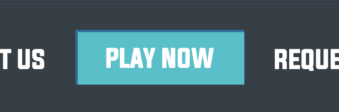

# OWASP Top 10

The OWASP Top 10 is one of many projects by OWASP. It is a standard awareness document for developers and web application security.

It represents a broad consensus about **the most critical security risks to web applications**, i.e. top 10 most frequently used exploits in a website or application.

The OWASP Top 10 document is globally recognised by developers as the **most effective first step towards changing the software development culture within your organisation** into one that produces more secure code. Companies should adopt this document and start the process of ensuring that their web applications minimise these risks.

Read more here: https://owasp.org/www-project-top-ten/

# 1. Injection


Injection flaws, such as SQL, NoSQL, OS, and LDAP (Lightweight Directory Access Protocol) injection, occur when **untrusted data is sent to an interpreter as part of a command or query**. The attacker’s hostile data can trick the interpreter into executing unintended commands or accessing data without proper authorisation.

## Activity

To illustrate this, let's play a game.

1. Go to https://securecodewarrior.com/

2. Click on `PLAY NOW` in the navbar:



3. Enter your name and select `JavaScript Node.js (Express)`:


4. Click on `Enter game mode`. You should end up here: https://portal.securecodewarrior.com/#/website-trial/web/injection/sql/nodejs/express/realm/teaser/level/showcase/quest/injection_sql

5. Follow the game instructions! You'll need to locate the vulnerability, and identify the correct solution.

## Prevention
- Provide a **parameterised interface**
- Do not use string-concatenated queries

- Validate user-supplied input. Read more [here](https://cheatsheetseries.owasp.org/cheatsheets/Input_Validation_Cheat_Sheet.html).
- Validate input server-side with a **whitelist** instead of a blacklist. This way, you can define exactly what IS authorised - everything else is not authorised.
- Use source code review tools
- Add automated testing for all parameters, headers, URL, cookies, JSON, SOAP, and XML data inputs

**More resources:**

- https://cheatsheetseries.owasp.org/cheatsheets/SQL_Injection_Prevention_Cheat_Sheet.html
- https://cheatsheetseries.owasp.org/cheatsheets/LDAP_Injection_Prevention_Cheat_Sheet.html


# 2. Broken authentication

Application functions related to authentication and session management are often implemented incorrectly, allowing attackers to compromise passwords, keys, or session tokens, or to exploit other implementation flaws to assume other users’ identities temporarily or permanently.

## Examples

1. [Brute-force attack](https://en.wikipedia.org/wiki/Brute-force_attack): the attacker submits many passwords with the hope of eventually guessing correctly
1. [Credential stuffing](https://owasp.org/www-community/attacks/Credential_stuffing): the attacker uses a list of **breached username/password pairs** and gains access to user accounts
1. [Session](https://auth0.com/docs/sessions/concepts/session-lifetime) timeout is not appropriately set up

## Prevention

- Implement [rate limits](https://auth0.com/docs/connections/database/rate-limits) - if a user enters their password incorrectly more than X times consecutively from a single IP address, they will be blocked from logging into their account from that IP address
- Implement Two-factor Authentication (2FA), e.g. Google Authenticator with a [TOTP (Time-based One-Time Password)](https://tools.ietf.org/html/rfc6238) generator like [Speakeasy](https://github.com/speakeasyjs/speakeasy)
- Implement Multi-factor Authentication (MFA) e.g. with [Okta](https://www.okta.com/products/adaptive-multi-factor-authentication/)
- Implement (CAPTCHA/reCAPTCHA](https://anydifferencebetween.com/difference-between-captcha-and-recaptcha/)
- Implement weak-password checks (e.g. minimum length, special characters/numbers required, check against well-known [weak/leaked passwords](https://github.com/danielmiessler/SecLists/tree/master/Passwords))
- Require reauthentication after every X hours, depending on the sensitivity of the data
- For high-risk data (e.g. financial information), set sessions to **time out after 2-5 minutes of idle time**. It can be set to 15-30 minutes for low-risk applications. e.g. with [express-session](https://www.npmjs.com/package/express-session#cookiemaxage-1) and setting `maxAge`/`expires` value:

```
var hour = 3600000
req.session.cookie.expires = new Date(Date.now() + hour)
req.session.cookie.maxAge = hour
```

**More resources:**

- https://cheatsheetseries.owasp.org/cheatsheets/Credential_Stuffing_Prevention_Cheat_Sheet.html
- https://github.com/danielmiessler/SecLists
- https://auth0.com/blog/when-ux-equals-keeping-or-losing-the-customer/

# 3. Sensitive data exposure

Many web applications and APIs do not properly protect sensitive data, such as financial, healthcare, and Personally Identifiable Information (PII). Attackers may steal or modify such weakly protected data to conduct credit card fraud, identity theft, or other crimes. Sensitive data may be compromised without extra protection, such as encryption at rest or in transit, and requires special precautions when exchanged with the browser.

## Examples

1. Passwords stored in plain text. A hacker gains access to the database and the username/password pairs. The hacker is able to use the passwords to log in to the affected user accounts.
2. Passwords stored are hashed with a simple algorithm, and is not salted. A hacker gains access to the database and the username/hashed password pairs, and is able to [reverse the hash](https://md5hashing.net/) to obtain the original password. The hacker is able to use the passwords to log in to the affected user accounts. 

## Activity

Let's explore some more examples with some interactive exercises.

1. [Token exposure in URL](https://application.security/free-application-security-training/owasp-top-10-token-exposure-in-url)
1. [PII data in URL](https://application.security/free-application-security-training/owasp-top-10-personally-identifiable-data-in-url)

Both of these instances can cause sensitive information to be exposed to third-party systems.

## Prevention

- **Always salt and hash passwords** (this is like adding extra data to the password and then scrambling it in a way that can't be reversed), e.g. with [bcrypt](https://www.npmjs.com/package/bcryptjs). This way, even if attackers gain access to the hashed passwords, they would not be able retrieve the original password, and would therefore be unable to log in to the affected user accounts. [Read more on why hashing **with a salt** is important.](https://auth0.com/blog/adding-salt-to-hashing-a-better-way-to-store-passwords/)
- Do **not** transmit sensitive data through URL query parameters, e.g. `website.com/resource?auth_token=q3hd8nd8s` or `website.com/register?email=user@email.com`
- Use [HTTP headers](https://developer.mozilla.org/en-US/docs/Web/HTTP/Headers) for transmitting sensitive data like session tokens
- Configure web forms submitting PII data to use the `POST` method
- Get SSL certificate from [Let's Encrypt](https://letsencrypt.org/), to enable secure connections with HTTPS. This means that all communications between your browser and the website are encrypted.
- Force SSL: force some or all pages to be visited over SSL, e.g. with [express-force-ssl](https://github.com/battlejj/express-force-ssl)

**More resources**:

- https://www.howtogeek.com/434930/why-are-companies-still-storing-passwords-in-plain-text/
- https://www.izooto.com/blog/understanding-http-https-protocols
